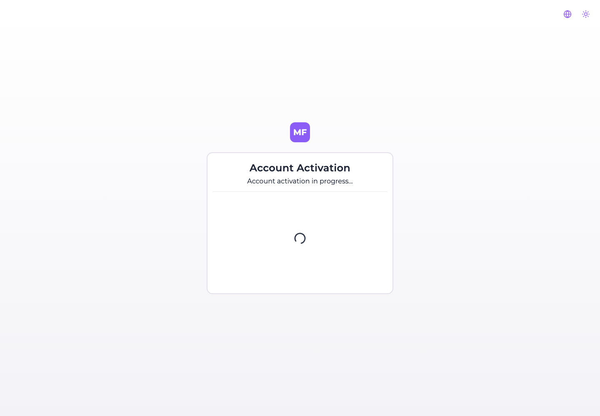
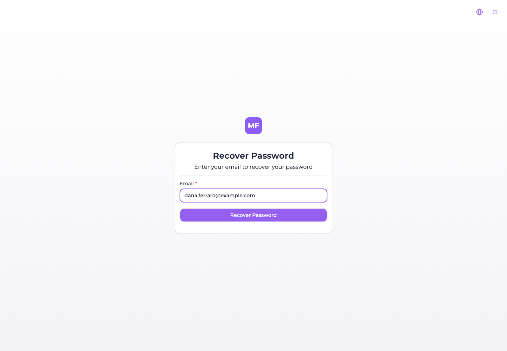
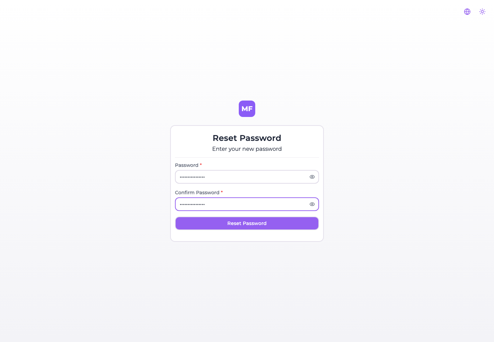
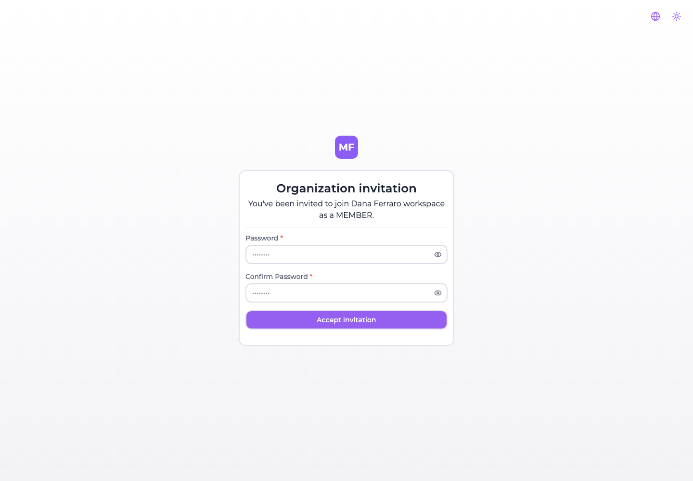
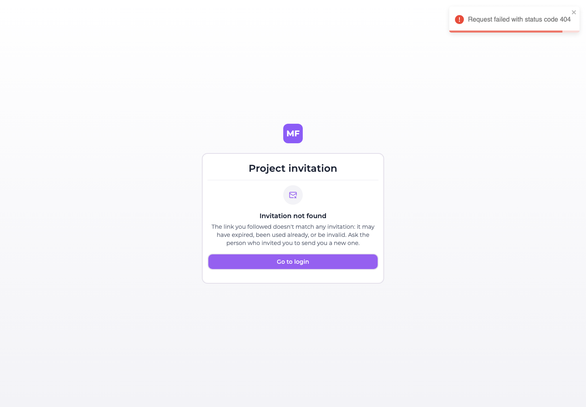

# Activation, password reset and invitations

Five routes of the console answer without a session, because each of them is the destination of a
link somebody received by email:

| Route | Reached from | The link lives |
| --- | --- | --- |
| `/account-activation/:token` | The email sent after [registering](#registration-and-activation) | 24 hours |
| `/reset-password-request` | The **Forgot your password?** link under the login form | — (it is a form, not a link) |
| `/reset-password/:token` | The email sent by that form | 1 hour |
| `/project-invitation/:token` | The email sent by [inviting somebody to a project](../project-settings/users-and-roles.md#inviting-a-member) | 5 days |
| `/organization-invitation/:token` | The email sent by [inviting somebody to an organization](../organizations/managing-an-organization.md#inviting-a-member) | 5 days |

The token is the whole of the authentication: whoever holds the link is whoever the email was sent
to, so it is worth treating one like a password until it is used.

:::danger Without SMTP an installation cannot do any of this
Every one of those tokens is delivered by email and by no other means. There is no screen that
prints a link, no CLI that generates one, and no way to read one back out of the console. An
installation with no `EMAIL_SMTP_HOST` therefore **cannot activate an account, cannot reset a
password and cannot confirm an invitation** — and it does not tell you so during installation.

What it does instead differs per flow, and only one of the three fails visibly:

| Flow | On an installation with no SMTP |
| --- | --- |
| Registration | Silently skipped. No token is created, no email is attempted, and the new account is usable straight away. |
| Invitations | Silently degraded. No token, no email: the address is added as an **already active member**, with nothing having proved the person owns it. |
| **Password reset** | **Broken.** The token is written, the send is attempted against a host that is not configured, and the screen reports success anyway. |

Configure SMTP before you let anybody else near the console. See
[`EMAIL_SMTP_HOST` and its siblings](../self-hosting/environment-variables.md).
:::

## Registration and activation

Registering at `/register` creates the account and sends an activation email carrying a link to
`/account-activation/:token`. The screen does its work as it mounts and leaves for the login as soon
as the API answers, so what a person actually reads is the moment in between:

There is nothing to fill in and nothing to confirm. On success a toast says the account is activated
and the console redirects to the login form; on a token that is unknown or more than 24 hours old the
card shows the error instead, and the account stays unactivated.

:::caution The activation link confirms the address — it does not gate access
Nothing in the platform refuses a session to an account whose activation link was never followed. A
new account is stored as `ACTIVE` from the moment it is created, and signing in never reads that
field: registering and going straight to the login form works, activation email untouched.

So treat the email as a confirmation that the address exists and reaches its owner, not as a barrier.
And note that `REGISTRATION_ALLOWED=false` is not one either: it hides the *Register* link without
closing the route behind it, as [The first startup](../self-hosting/first-startup.md#the-endpoint-stays-open)
sets out. A self-hosted installation that must not accept accounts has to be closed off in front of
the console — a private network, an ingress rule, an authenticating proxy.
:::

Where SMTP is not configured the flow is shortened rather than broken: no activation token is
generated at all, no email is attempted, and the registration screen sends the person to the login
form with "log in to access your account" instead of "we have sent you an email".

## Recovering a password

**Forgot your password?** under the login form leads to `/reset-password-request`, which asks for one
thing:

Submitting it always ends the same way, whatever the address was: a message reading *"If an account
exists with this email, you will receive a password reset link"*, and back to the login form. The
screen is deliberately non-committal about whether the account exists.

:::note The screen does not reveal whether the account exists. The API does.
`POST /api/users/forgot-password` answers with an error for an address it has never seen, and the
console shows its success message regardless of what came back. So the reassurance is real for
somebody reading the page and not for somebody watching the response — worth knowing if you put the
console behind a WAF or read its access logs.
:::

The email carries a link to `/reset-password/:token`, good for **one hour** and for one use — the
token is cleared from the account the moment a password is set through it.

The new password must be at least 8 characters and the second field must match the first. Both rules
are checked in the browser; the confirmation field exists only there, and the API is sent the
password alone.

:::danger On an installation without SMTP the reset says it worked and nothing was sent
This is the one flow that does not check whether email can be delivered before it starts. The token
is generated and stored on the account, the send is attempted against a transport with no host
configured, and the request fails — but the console has already shown its "check your email"
message, because it displays that message without waiting for the answer.

The person is left waiting for an email that was never sent, on an account whose reset token is now
ticking. There is no way out of it from the console: an operator has to reset the password out of
band, or configure SMTP and have them ask again.
:::

## Accepting an invitation

Both invitation links land on the same shape of screen, one naming a project and one naming an
organization, each stating the role that was chosen:

The two password fields are **conditional**: they appear only when the invitee has no password yet,
which is the case for somebody the invitation itself created. Somebody who already had an account on
this installation sees the same card with nothing but **Accept invitation** on it.

Accepting does three things at once: it sets the password when one was asked for, it marks the
account active, and it signs the person in — the response carries an access token, so they land in
the console already authenticated rather than at the login form.

An invitation link is good for **five days**. The date is shown to whoever sent it, under
**Expires on** in the [pending invitations](../project-settings/users-and-roles.md#managing-invitations)
table.

### When the link does not work

A token that matches no invitation — because it was already accepted, or revoked, or mistyped — gets
a screen that says so and offers the way back:

:::caution An expired invitation does not say "expired"
The screen above is shown when the API answers *not found*. An invitation that exists but is past
its five days answers with a different status, and the console has no case for it: it falls back to
**"Something went wrong — We couldn't load the invitation. Please try again in a moment."**

Trying again in a moment will never help, and the person has no way to tell an expired link from a
console having a bad minute. If somebody reports that message, check the invitation's **Expires on**
date and [resend](../project-settings/users-and-roles.md#managing-invitations) it.

Both cases also raise a toast carrying the raw HTTP message — *"Request failed with status code
404"* — which is not addressed to the person reading it. Ignore it; the card underneath is the real
answer.
:::

### The route that needs no email

Somebody who is already registered and signed in does not need the emailed link at all. Invitations
addressed to them are listed inside the console, and can be accepted or declined from there — which
is also the only way an invitation can be answered on an installation where email does not leave the
building. See [Switching organization](../organizations/managing-an-organization.md#switching-organization).

## What the platform sends, and when

Four emails exist in the product. There is no fifth, no digest, and nothing periodic:

| Email | Sent when | Subject | Link expires |
| --- | --- | --- | --- |
| Account activation | An account registers, and SMTP is configured | 🎉 Activate Your Account | 24 hours |
| Password reset | The recovery form is submitted | 🔑 Reset Your Password | 1 hour |
| Project invitation | Somebody is invited to a project, or the invitation is resent | 🎉 You're invited to join *project* | 5 days |
| Organization invitation | Somebody is invited to an organization, or the invitation is resent | 🎉 You're invited to join *organization* | 5 days |

The origin of every link in them comes from `FRONTEND_URL` on the backend, not from the host the
browser used: set it to the address people actually reach the console at, or the links will point
somewhere they cannot follow.

Nothing here is marketing. The platform records a
[marketing consent](./profile.md#marketing-communications) where an operator turns that on, and never
sends a commercial email of its own.
