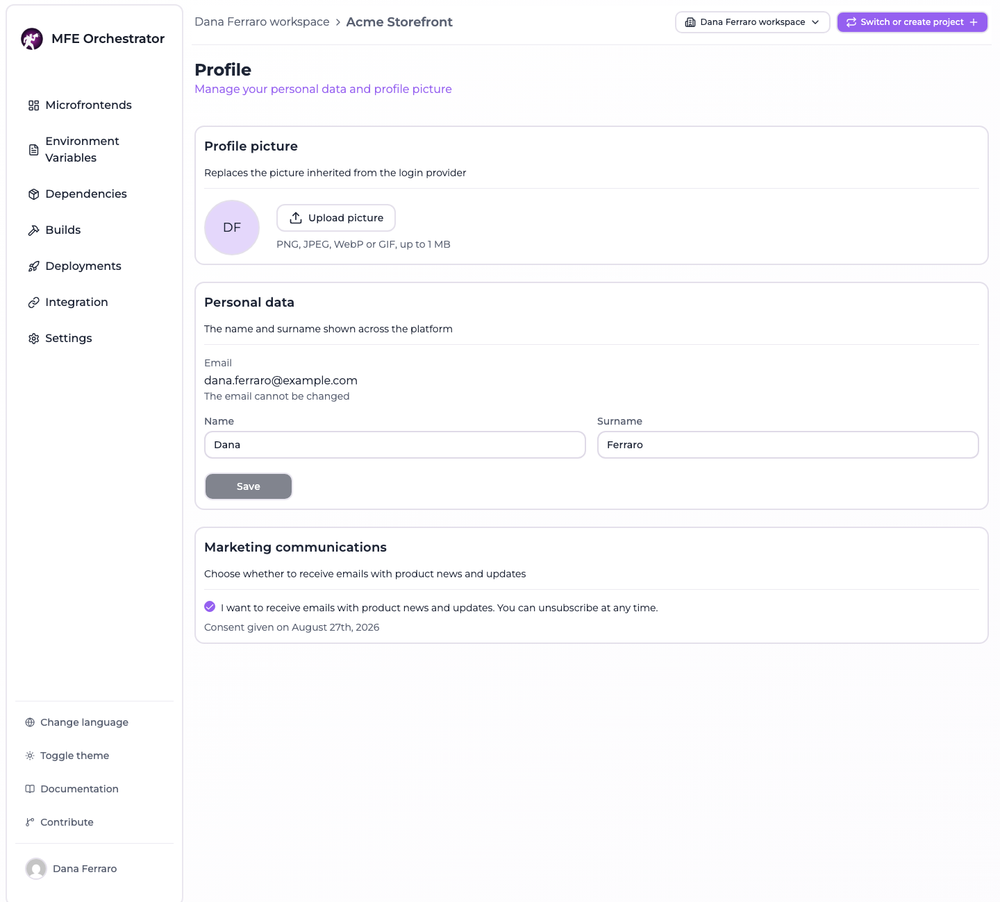
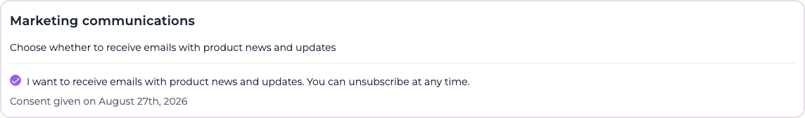

# Your profile

The profile page is about the person signed in rather than about a project. Open it from the
**account button at the bottom of the sidebar** — the one carrying your name — and then **Profile**.

Three cards, and the third is conditional: **Marketing communications** exists only on an
installation that [collects a consent](#marketing-communications). The page lives inside the console
layout, so it needs a project selected to be reachable at all — a brand new account is asked to
create one first.

## Profile picture

**Upload picture** opens the file dialog; **Remove** appears next to it once a picture is stored.
Until then the circle shows your initials, taken from the name and surname on the card below, or a
generic person icon when neither is set.

The rules are not on the screen in full, so here they are:

| | |
| --- | --- |
| Accepted formats | PNG, JPEG, WebP and GIF — those four, as a list and not "any image" |
| Maximum size | 1 MiB (1 048 576 bytes) |
| Where it is stored | In the database of your own installation, in a collection of its own, one picture per user |
| How it reaches the browser | Inline, as a `data:` URI on an authenticated response — there is no public URL for it |

Both limits are checked twice: once in the browser, so an upload that would be refused is not sent,
and once on the server, which is the check that actually decides. The server measures the **bytes it
received**, not the length the upload claimed in its headers, so a client that lies about the size
gains nothing.

:::note Why a list of four formats and not "any image"
The picture is served back into the origin of the console, and `image/svg+xml` is a document that can
carry script. Accepting anything beginning with `image/` would make a profile picture a way to run
code in the console of everybody who looks at it. The four formats above are the ones that are only
ever pixels.
:::

Removing a picture asks for a confirmation and is immediate — there is no version of it kept.

:::info The picture in the sidebar is not always this one
This card is the only place your **uploaded** picture comes from, and the only picture it will ever
show. The small avatar in the sidebar falls back through several sources when you have not uploaded
one: the picture from your Auth0 or Google login if you signed in that way, and failing that
**Gravatar**, addressed by a hash of your email.

That last fallback means a console with no picture uploaded makes a request to `gravatar.com` from
the browser, carrying a hash of the signed-in address. Uploading a picture here stops it: the
uploaded one wins over every other source.
:::

## Personal data

The name and surname shown wherever the platform names you — the sidebar, the members list of a
project, an invitation email. Both are optional, both are capped at 100 characters, and **Save**
stays disabled until something actually changes.

The email is displayed and cannot be edited, by design rather than by omission: it is the identity
the account is looked up by, and the address every
[emailed link](./email-flows.md) is sent to. There is no
change-of-address flow — an account is created with the address it keeps.

## Marketing communications

This card appears only where the operator of the installation turned the consent on with
`MARKETING_OPT_IN_ENABLED`. Where they did not, the section is absent from the page and the endpoint
behind it refuses the change — there is nothing to consent to.

It behaves unlike the rest of the page in one deliberate way: **there is no Save button**. Ticking
the box is the act, and it is stored the moment you tick it. A consent sitting unsaved in a form is
neither given nor withheld, so the form does not offer that state.

What gets recorded when you grant it is three things: that you granted it, the moment you did, and
the **version of the text you agreed to** — the last one is what keeps an old consent attributable to
the wording it was given for. The date is printed under the box, as in the shot above. Withdrawing
clears all three: a date left next to a withdrawn consent would read as though the consent were still
the one given that day.

Only the consent currently in force is kept. The page shows no history of the times it was granted and
withdrawn, and none is stored.

:::info The platform records the consent and never sends a marketing email
This is worth stating plainly, because a consent checkbox usually implies a mailing list behind it.
MFE Orchestrator sends exactly four emails — account activation, password reset, project invitation,
organization invitation — and all four are transactional. There is no newsletter, no product-update
mail, no announcement, and no code anywhere in the product that reads this field to decide who to
mail.

The consent is a **record**, kept so that whoever runs a mailing list elsewhere has a lawful and
dated basis for the addresses on it. On a self-hosted installation that list is yours; on an
installation where nobody runs one, turning `MARKETING_OPT_IN_ENABLED` on collects a consent that
nothing will ever act on.
:::

The registration form carries the same checkbox, under the same condition, and it starts unticked —
a box that arrives already ticked is not a consent. Whichever of the two you use, the record is the
same.
