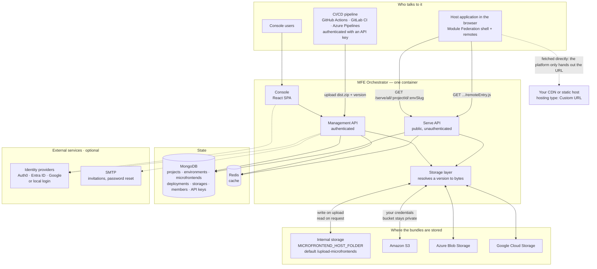
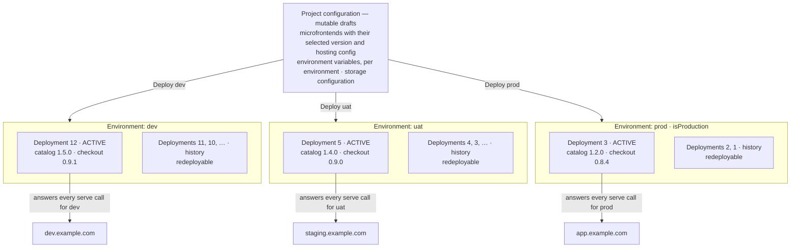
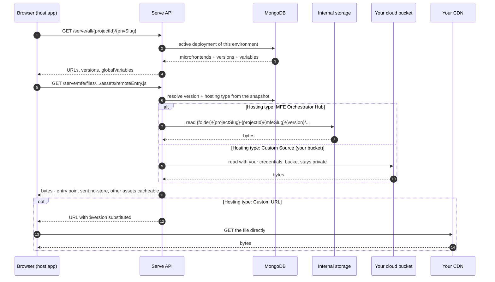
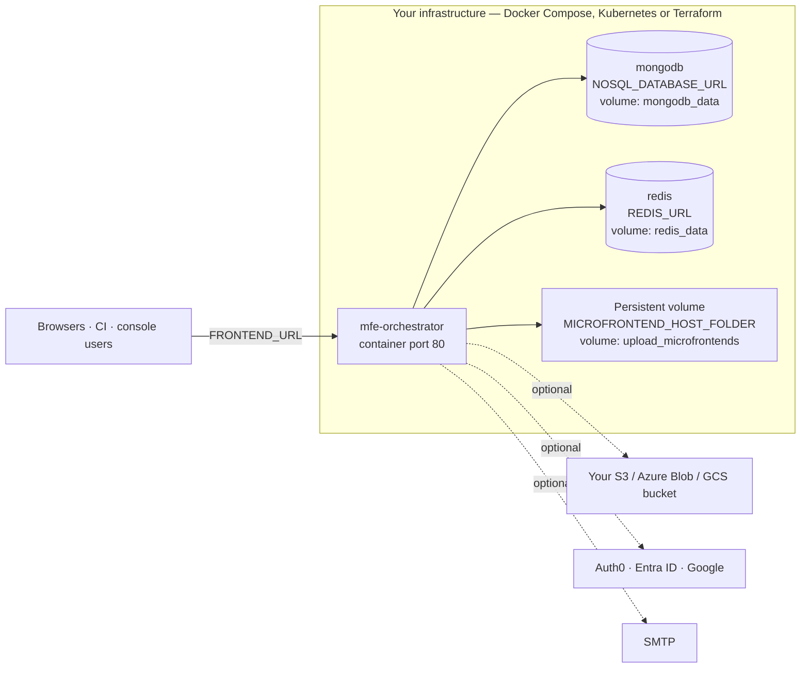

# Architecture

MFE Orchestrator is a **control plane**: it stores what your microfrontends are, which versions
belong to which environment, and where their files live — then answers, at runtime, the single
question your host application asks: *what should I load?*

This page draws that out. If you have not read [Core concepts](./core-concepts.md) yet, start
there: the boxes below are the objects described on that page.

## The system at a glance

The orchestrator ships as **one container**. It serves the console, the authenticated management
API and the public serve API from the same process, and keeps its state in MongoDB and Redis.
Artifacts — the actual microfrontend bundles — live outside the database, either on the
orchestrator's own storage or in a cloud bucket you own.



A few things worth reading off the diagram:

- **The browser never talks to your bucket.** For internal storage and for
  [Custom Source](./microfrontends/hosting-options.md#custom-source-your-own-bucket) buckets, the
  serve API reads the bytes server-side with your credentials and streams them back. Your bucket
  stays private and needs no CORS configuration. The one exception is
  [Custom URL](./microfrontends/hosting-options.md#custom-url), where the platform returns a URL
  and the browser fetches it itself.
- **The serve API is public and unauthenticated** by design — it is called from browsers. The
  management API is the authenticated surface, used by the console and by CI with an
  [API key](./ci-cd/api-keys.md).
- **Artifacts are not in the database.** MongoDB holds configuration and deployment snapshots;
  bundles live on disk or in object storage.
- **Git providers are reached from the management API**, not shown above to keep the picture
  readable: with a [repository](./repositories/connect/github.md) connected, the platform scaffolds
  a repo from a template, injects a build pipeline and creates the deploy secret that pipeline
  needs.

## Deployments across environments

A project's configuration is mutable — versions, variables and storage settings are drafts. A
**deployment** freezes them into an immutable snapshot for **one environment**, and exactly one
snapshot is active per environment at any moment. That is what lets `prod` keep serving `1.2.0`
while you stage `1.4.0` in `uat` from the same project.



The snapshot is a **copy**, not a set of references — editing a microfrontend afterwards does not
reach back into it. Two consequences:

- **Rollback is activation, not rebuild.** Redeploying `#2` in `prod` re-activates an older
  snapshot; the artifacts it points at were never deleted.
- **Promotion is just a deployment.** Select the version live in `uat`, deploy `prod`. The bundle
  is not rebuilt or copied — both environments point at the same stored files, and what differs is
  the [environment variables](./environments/environment-variables.md) each snapshot carries.

Which environment a request belongs to can be given explicitly, or resolved from the browser's
`Referer` against the environment's [allowed domains](./environments/domains.md) — the arrows on
the right of the diagram. That is what lets one build run unchanged in every environment.

See [Deployments](./deployments/overview.md) for the full behaviour.

## How a request for a bundle is answered

The hosting type of each microfrontend decides where the bytes come from. The host application's
URL does not change between the three cases — only what the orchestrator does behind it.



The entry point is always served with `Cache-Control: no-cache, no-store, must-revalidate`, while
the hashed assets around it stay cacheable — which is why a deployment takes effect immediately
without stale chunks. All served files carry `Cross-Origin-Resource-Policy: cross-origin` so a
host on a different origin can load them.

Details: [Serve API reference](./integration/serve-api.md),
[Hosting options](./microfrontends/hosting-options.md), [Buckets](./buckets/overview.md).

### Artifact path layout

Both internal storage and your own bucket use the same deterministic layout, with the project id
in the prefix so several projects — and several installations — can share one bucket:

```
<root>/<projectSlug>-<projectId>/<microfrontendSlug>/<version>/…
```

Versions sit side by side and nothing is overwritten on release. That is what makes rollback
instant, and why you may want a lifecycle rule on old objects — see
[Housekeeping](./buckets/overview.md#housekeeping).

## Running the orchestrator itself

The same control plane runs either as the hosted console or on your own infrastructure. Only the
API base URL differs. Self-hosted, the reference topology is the container plus MongoDB, Redis and
a persistent volume:



:::caution Mount the artifact folder
`MICROFRONTEND_HOST_FOLDER` must sit on a persistent volume. Without it, every container restart
loses the builds uploaded to the internal storage — in the reference `docker-compose.yaml` that is
the `upload_microfrontends` volume.
:::

MongoDB and Redis can be replaced by managed services; the identity providers, SMTP and cloud
buckets are all optional. See [Docker Compose](./self-hosting/docker-compose.md),
[Terraform](./self-hosting/terraform.md),
[Use external resources](./self-hosting/use-external-resources.md) and the full
[environment variable reference](./self-hosting/environment-variables.md).
