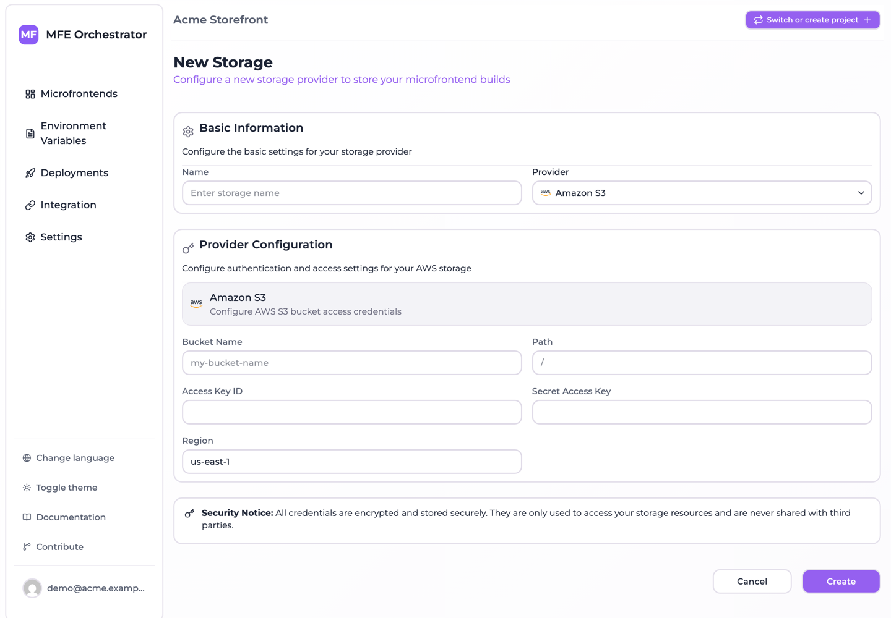

# Store builds on Amazon S3

This page walks through connecting an S3 bucket to MFE Orchestrator.

## Prerequisites

- An AWS account
- Permission to create S3 buckets and IAM users/policies

## Step 1: Create the bucket

In the AWS console, open **S3 → Create bucket**:

- **Bucket name** — globally unique, e.g. `acme-microfrontends`
- **Region** — pick one close to your users; note it, you will need it
- **Block Public Access** — leave **enabled**

:::tip Keep the bucket private
MFE Orchestrator reads objects server-side with your credentials and streams them to browsers
itself. The bucket never needs to be public, and no CORS configuration is required.
:::

Versioning is optional. MFE Orchestrator already stores each release under its own version prefix,
so S3 versioning adds protection against accidental overwrites rather than release history.

## Step 2: Create an IAM policy

Create a policy granting only what the platform needs. Replace `acme-microfrontends` with your
bucket name, and `mfe/` with your intended path prefix (or drop the prefix to allow the whole
bucket):

```json
{
  "Version": "2012-10-17",
  "Statement": [
    {
      "Sid": "ObjectAccess",
      "Effect": "Allow",
      "Action": [
        "s3:GetObject",
        "s3:PutObject"
      ],
      "Resource": "arn:aws:s3:::acme-microfrontends/mfe/*"
    },
    {
      "Sid": "ListBucket",
      "Effect": "Allow",
      "Action": "s3:ListBucket",
      "Resource": "arn:aws:s3:::acme-microfrontends",
      "Condition": {
        "StringLike": {
          "s3:prefix": "mfe/*"
        }
      }
    }
  ]
}
```

Note there is no `s3:DeleteObject`: MFE Orchestrator never deletes artifacts. Leaving it out means a
compromised key cannot destroy your release history. Add it only if you plan to use the same
credentials for housekeeping — better still, use a
[lifecycle rule](https://docs.aws.amazon.com/AmazonS3/latest/userguide/object-lifecycle-mgmt.html),
which needs no credentials at all.

## Step 3: Create an IAM user and access key

1. **IAM → Users → Create user**, e.g. `mfe-orchestrator`.
2. Do **not** grant console access — this identity is only used programmatically.
3. Attach the policy from step 2.
4. Open the user, go to **Security credentials → Create access key**, and choose
   *Application running outside AWS*.
5. Copy the **Access key ID** and **Secret access key**. The secret is shown once.

## Step 4: Add the storage in MFE Orchestrator

Go to **Settings → Storages → New Storage** and select **Amazon S3**:

| Field | Value |
| --- | --- |
| **Name** | A label, e.g. *Production S3* |
| **Bucket Name** | `acme-microfrontends` |
| **Path** | Optional prefix inside the bucket, e.g. `mfe`. Leave blank for the bucket root |
| **Access Key ID** | From step 3 |
| **Secret Access Key** | From step 3 |
| **Region** | The bucket's region, e.g. `eu-west-1` |



Save.

## Step 5: Point a microfrontend at it

Open a microfrontend, set **Hosting type** to **Custom Source**, select this storage, and save.
Publish a new version — the artifact now lands in your bucket, at:

```
mfe/<projectSlug>-<projectId>/<microfrontendSlug>/<version>/…
```

Then [deploy](../deployments/overview.md) the environment.

## Troubleshooting

**`AccessDenied` on upload**

The key lacks `s3:PutObject` on the path being written. Check the policy's `Resource` ARN covers
your configured **Path** prefix — a policy scoped to `mfe/*` will reject writes if the storage has
no path set, because objects then land at the bucket root.

**`AccessDenied` on serving, but upload worked**

`s3:GetObject` is missing. Both actions are needed: the platform writes on upload and reads on every
request.

**`NoSuchBucket` or region errors**

The **Region** field must match the bucket's actual region. A bucket in `eu-west-1` configured as
`us-east-1` fails to resolve.

**Files upload but the app 404s**

Usually the **Entry Point**. Check what your build actually produces — Vite Module Federation emits
`assets/remoteEntry.js`, not `remoteEntry.js`. You can verify by browsing the version prefix in the
S3 console.

## Cost notes

The traffic pattern is `GET` requests from MFE Orchestrator to S3, one per file served, plus egress
from S3 to the platform. Both are small for typical bundles, but if your microfrontends are heavily
trafficked and large, consider a bucket in the same region as your MFE Orchestrator installation to
reduce inter-region egress.
