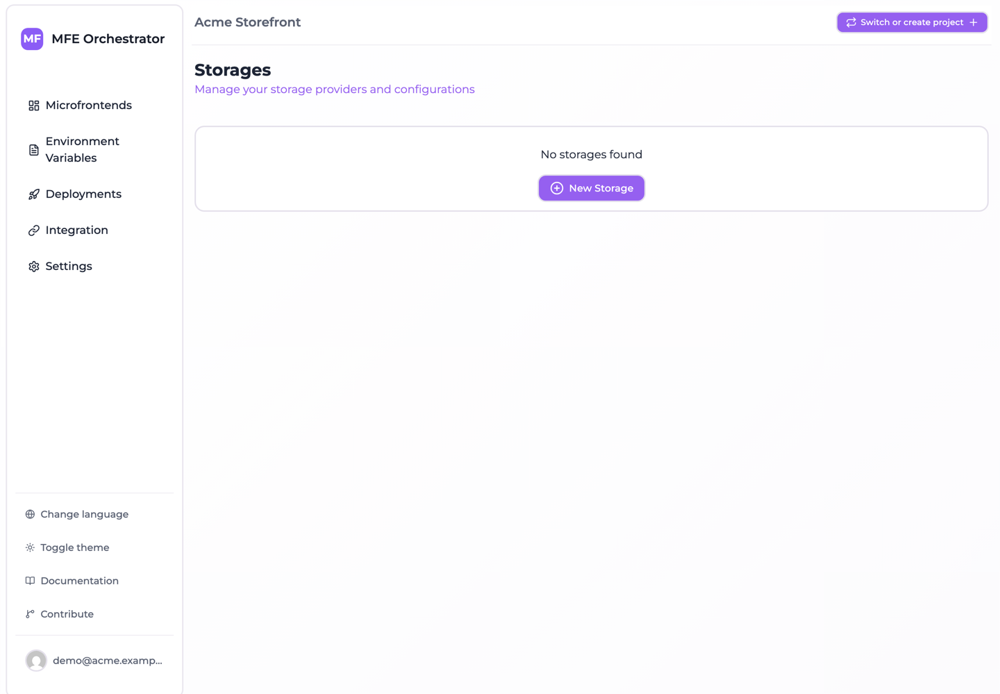
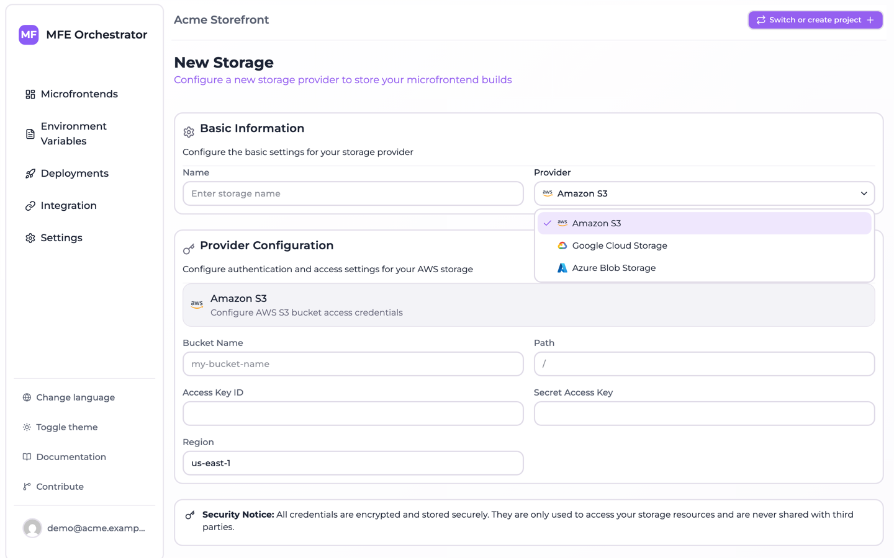
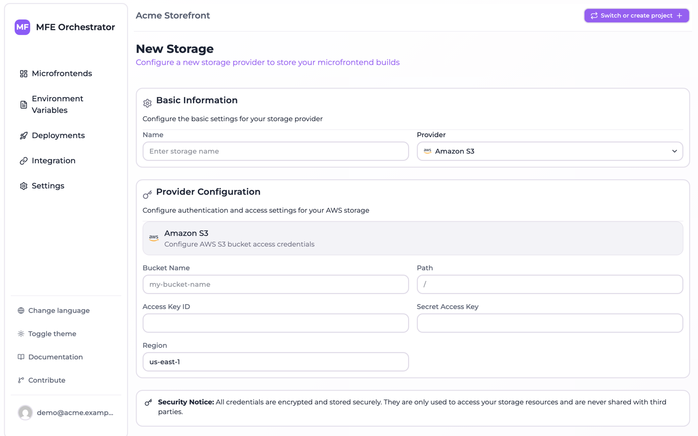

# Storage overview

A **bucket** — a *storage* in the console — is a connection to object storage you own. With one
configured, microfrontend builds are stored in your own cloud account instead of on the platform,
while MFE Orchestrator continues to handle versioning, deployments and serving.

Buckets live under **Settings → Storages**.



## Why use your own bucket

| | MFE Orchestrator Hub | Your bucket |
| --- | --- | --- |
| Where artifacts live | Platform storage | Your cloud account |
| Data residency control | ❌ | ✅ |
| Your retention & backup policy | ❌ | ✅ |
| Setup effort | None | Bucket + credentials |
| Durability guarantees | Platform's | Your provider's SLA |

For production use — and for anything with compliance requirements — your own bucket is the right
answer. The hub is excellent for getting started and for self-hosted installations where you
already own the disk.

## Supported providers

| Provider | Authentication methods |
| --- | --- |
| [Amazon S3](./aws-s3.md) | Access key ID + secret access key |
| [Azure Blob Storage](./azure-blob-storage.md) | Connection string, shared key, or Azure AD application |
| [Google Cloud Storage](./google-cloud-storage.md) | Service account JSON key |

## How it works

Once a storage is configured and selected on a microfrontend whose hosting type is
**Custom Source**:

```
CI uploads dist.zip
      │
      ▼
MFE Orchestrator extracts it and writes to YOUR bucket
      │
      ▼
Browser requests remoteEntry.js
      │
      ▼
MFE Orchestrator reads from YOUR bucket with your credentials
and streams the file back
```

Two things follow from this:

- **Your bucket does not need to be public.** Files are read server-side with the credentials you
  configured. Keep the bucket private.
- **Your bucket does not need CORS configuration.** The browser talks to MFE Orchestrator, not to
  your bucket, so cross-origin headers are the platform's concern.

## Path layout

Files are stored under a deterministic path:

```
<storage path>/<projectSlug>-<projectId>/<microfrontendSlug>/<version>/…
```

For example, with a storage `path` of `mfe`:

```
mfe/my-shop-68f1a2b3c4d5e6f7/catalog/1.4.0/assets/remoteEntry.js
mfe/my-shop-68f1a2b3c4d5e6f7/catalog/1.4.0/assets/index-4f2a.css
mfe/my-shop-68f1a2b3c4d5e6f7/catalog/1.5.0/assets/remoteEntry.js
```

The project id is part of the prefix, so several projects — and several MFE Orchestrator
installations — can share one bucket without colliding. Versions sit side by side, which is what
makes rollback instant: nothing is overwritten or deleted on a new release.

## Adding a storage

1. Go to **Settings → Storages** and click **New Storage**.
2. Give it a **Name** and pick the **Provider**.

   

3. Fill in the provider-specific credentials — see the per-provider pages.
4. Optionally set a **Path** prefix inside the bucket.
5. Save.



:::caution The provider cannot be changed later
A storage's provider type is fixed at creation. To move from S3 to GCS, create a new storage and
re-point your microfrontends at it.
:::

You can mark one storage as the **default** for the project, which is then preselected for new
microfrontends.

## Using a storage

On the microfrontend, set **Hosting type** to **Custom Source** and pick the storage. Then upload
as usual — the platform routes the artifact to your bucket. See
[Hosting options](../microfrontends/hosting-options.md).

Existing versions are not migrated when you change a microfrontend's storage. Change it, then
publish a new version.

## Credentials and least privilege

MFE Orchestrator needs to read and write objects under its prefix, and nothing else. Each provider
page includes a minimal permission set — grant that rather than a broad administrative role.

Credentials are stored by the platform and never returned to the browser once saved. Rotate them
on your provider's normal schedule and update the storage when you do.

## Housekeeping

The platform never deletes old versions: every release you have ever published stays in the bucket.
That is what makes rollback reliable, but it does grow without bound. Consider a lifecycle rule that
expires objects older than your rollback window — S3 lifecycle policies, Azure blob lifecycle
management, or GCS object lifecycle.

:::caution
Do not expire objects still referenced by a deployment you might roll back to. A rule that deletes
anything older than 90 days is safe if your rollback window is a fortnight; a rule that keeps only
the two newest versions is not, because an environment may be sitting on an older one.
:::
