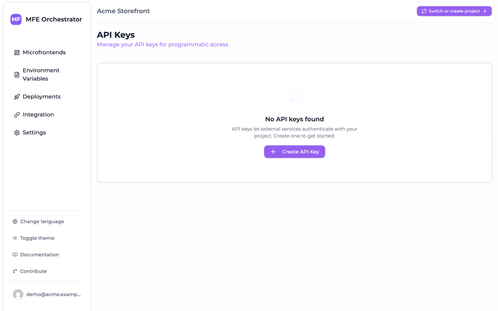
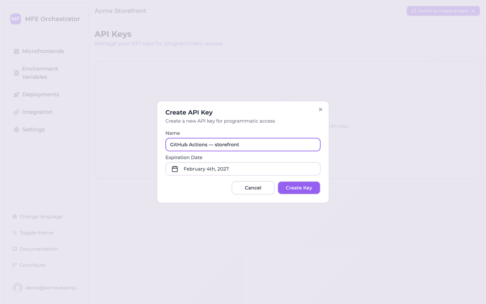

# API keys for CI/CD

An API key authenticates a machine — a CI pipeline, a deploy script, an automation job — against a
single project. Keys live under **Settings → API Keys**.

## Creating a key

1. Go to **Settings → API Keys** and click **Create API Key**.

   

2. Give it a **Name** describing where it will be used, e.g. *catalog GitHub Actions*.
3. Pick an **Expiration Date**. The date is sent as the *start* of the selected day (midnight UTC),
   so pick the day after the last one you want the key dated for.
4. Click **Create Key**.

   

The key is displayed once, in a dialog with a **Copy & Close** button.

:::caution Shown exactly once
The key is stored hashed and can never be retrieved again — the list view has no key column at all.
If you lose it, delete the key and create a new one.
:::

## Expiry is recorded, not enforced

Every key carries an expiry date and the list marks it **Active**, **Expiring soon** or **Expired**
from that date.

:::caution An expired key still works
Read this before you rely on the expiry date for anything. The authentication check loads the keys,
compares the presented value against their hashes and returns the project the match belongs to. It
reads neither the `status` field nor `expiresAt`. So a key the console shows as **Expired**
authenticates exactly like a live one, indefinitely, and the badge is a reminder to a human rather
than a control.

**Deleting the key is the only action that stops it.**
:::

There is still no way to create a non-expiring key, and the date is still worth setting honestly: it
is what tells you, and the next person, when a key was meant to be retired.

:::tip
Put the expiry date in whatever calendar your team actually reads, and treat it as the date you
*delete* the key. Rotate by creating the new key first, updating the consumer, then deleting the old
one.
:::

## What a key can call

One endpoint: the [upload](#using-a-key) of a microfrontend version.

```
POST <API_BASE>/microfrontends/by-slug/:slug/upload/:version
```

Everything else on the API — creating a deployment, editing a microfrontend, reading the build
status — is authenticated with the token of a signed-in user and answers an API key with an
authentication error. So a pipeline can *publish* a version, and it cannot *deploy* it; see
[publishing does not deploy](./manual-upload.md#publishing-does-not-deploy).

## Roles

A key carries a role in the database — `MANAGER` or `VIEWER` — and neither the console nor the API
gives you anything to do with it.

- **You cannot choose it.** The create dialog asks for a name and an expiry date, nothing else, and
  every key it produces is a `MANAGER`. Keys created automatically for a scaffolded repository are
  `MANAGER` too.
- **It is never checked.** No authorization path reads the role, so a `VIEWER` key — if you could
  create one — would upload exactly like a `MANAGER` one.

Treat the role as an unused field, and the *key itself* as the credential to protect. Anywhere the
CI pages ask for a key, any key the console gives you is the right one.

## Keys created for you

You often do not need to create a key at all. Connecting a code repository — or editing an existing
connection — creates a key and writes it into your Git provider under the name the generated
pipelines read, `MICROFRONTEND_ORCHESTRATOR_API_KEY`. It happens once per connection, not once per
microfrontend, and is skipped when a secret of that name already exists.

| Provider | Where the key is written | Scope |
| --- | --- | --- |
| GitHub | Organization secret, visible to all repositories | The organization on the connection |
| GitLab | Group CI/CD variable | The group you selected on the connection |
| Azure DevOps | Variable group `MFE_ORCHESTRATOR_SECRETS` | The Azure DevOps project |

:::caution A personal GitHub account gets no organization secret
Each injector needs an organization or group id and returns without doing anything when there is
none. A GitHub connection to a personal account has no organization, so no secret is written and a
pipeline in an existing repository cannot authenticate — the publish step fails with an
authentication error on its first run and nothing in the console says why.

For repositories the console creates itself under a personal connection it falls back to a
**repository** secret of the same name, so those work. Repositories you connected by hand need the
secret added by hand: create an [API key](#creating-a-key) and add it as a repository secret named
`MICROFRONTEND_ORCHESTRATOR_API_KEY`.
:::

You will find these keys in the API Keys list named
`MFE_ORCHESTRATOR_DEPLOY_SECRET - <provider> - <repository>`. Do not delete them unless you intend
to break the corresponding pipeline.

:::note They are dated 15 days out
The expiry on an automatically created key is computed as `3600 * 1000 * 365` milliseconds — 365
*hours*, not a year — so it is about 15.2 days. The console badges it **Expired** two weeks after
the connection was made, while the key keeps working, because expiry is not enforced. Nothing breaks;
the badge is simply wrong about it.
:::

## Using a key

Send it in the `api-key` header:

```bash
curl -X POST \
  -H "api-key: $MFE_ORCHESTRATOR_API_KEY" \
  -F "file=@dist.zip" \
  "<API_BASE>/microfrontends/by-slug/catalog/upload/1.4.0"
```

A query parameter is also accepted, for clients that cannot set headers:

```
<API_BASE>/microfrontends/by-slug/catalog/upload/1.4.0?apiKey=…
```

:::caution Prefer the header
Query strings end up in access logs, browser history and proxy logs. Use `?apiKey=` only when
setting a header is genuinely impossible.
:::

The project is derived from the key, so requests authenticated this way do not need a `project-id`
header.

## Stopping a key

There is one action: **Delete**, the trash button on the key's row in the list.

:::caution Revoking does not exist, and would not work
The API has a `PUT /api-keys/:id/revoke` endpoint that sets a key's `status` to inactive, and nothing
calls it — the console offers no Revoke control. It would not help if it did: the authentication
check never reads `status`, so a revoked key authenticates like a live one.

Deleting the key is what stops it. There is no way to keep the record for the audit trail and stop
the credential at the same time; if you need the history, note the key's name and expiry before you
delete it.
:::

## Good practice

**One key per consumer.** A key per pipeline, not one shared across the organisation. Rotating or
revoking then affects one thing, and the name tells you what breaks.

**Never commit a key.** Use your CI's secret store. Keys are UUIDs and match no distinctive pattern,
so secret scanners will not catch one you paste into a repository.

**Scope by project.** A key grants access to its project only. Cross-project automation needs one
key per project — which is the correct blast radius, not an inconvenience to work around.

**Treat a leaked key as a live incident.** Any key can publish arbitrary JavaScript to your
production microfrontends. **Delete it first, investigate second** — deleting is the only thing that
stops it, and nothing else you can do in the console reduces its access at all. Then create a
replacement and update the consumer.
