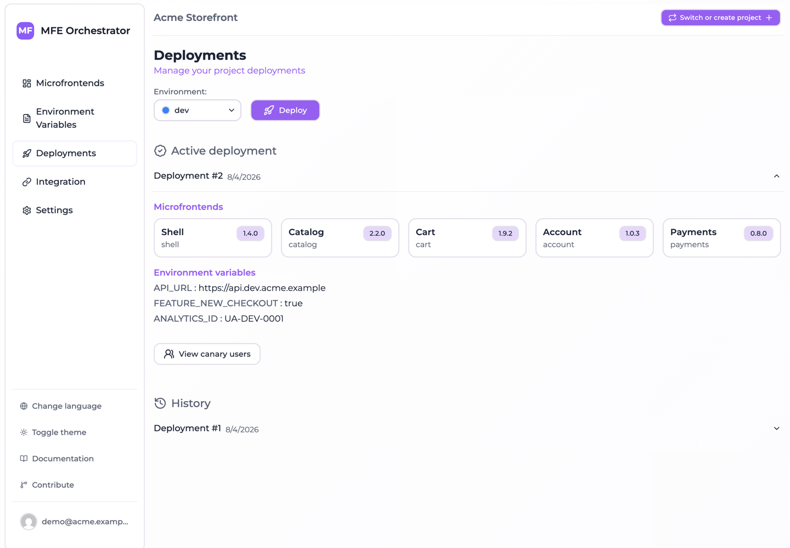

# Core concepts and object model

Before diving into the individual features, it helps to understand the handful of objects
MFE Orchestrator is built around. Everything you do in the console — and every call you make
to the API — maps onto one of them.

## The object model

```
Project
├── Environment (dev, uat, prod, …)
│   ├── Environment Variables (key/value, per environment)
│   └── Deployment #1, #2, #3 …  (immutable snapshots)
├── Microfrontend (host or remote, versioned)
├── Storage / Bucket (S3, Azure Blob, GCS)
├── Code Repository (GitHub, GitLab, Azure DevOps)
├── API Key (for CI/CD and automation)
└── Members (Admin, Editor, Viewer)
```

### Project

A **project** is the top-level container and the boundary for authorization: every other object
belongs to exactly one project, and access is granted per project. A project has a `name`, a
`slug` and an `id` — you can find all three under **Settings → Project Information**.

When you call the API directly, the project is selected with the `project-id` HTTP header.

### Environment

An **environment** is a deployment stage inside a project — typically `dev`, `uat` and `prod`,
but you can define as many as you like. Each environment has:

| Field | Purpose |
| --- | --- |
| `name` | Display name, e.g. *Production* |
| `slug` | URL-friendly identifier used in the public serve API, e.g. `prod` |
| `color` | Colour used to tag the environment throughout the console |
| `isProduction` | Marks the environment as a production stage |
| `domains` | The domains your application is served from — used to resolve which environment a browser request belongs to |
| `order` | Sort order in the environment selector |

The `slug` is unique within a project.

:::info Why domains matter
Some public endpoints resolve the environment automatically from the browser's `Referer`
header, by matching it against the environment's **Allowed Domains**. This is what lets a
single microfrontend URL serve the right version to `app.example.com` and to
`staging.example.com`. See [Environments → Allowed domains](./environments/domains.md).
:::

### Microfrontend

A **microfrontend** is a versioned frontend bundle registered in a project. It is either:

- a **host** — the shell application that loads other microfrontends, or
- a **remote** — a microfrontend consumed by a host.

Hosts and remotes are wired together by declaring parent/child relations in the console, and
MFE Orchestrator turns those relations into the `remotes` block of your Module Federation
configuration.


Each microfrontend has a `slug` (unique per project), a `version`, and a **hosting type** that
tells the platform where its files actually live. See
[Microfrontends → Hosting options](./microfrontends/hosting-options.md).

### Environment variable

An **environment variable** (also called a *global variable*) is a `key`/`value` pair scoped to
a single environment. Unlike build-time variables baked into your bundle, these are read at
runtime by the browser, which means the same artifact can be promoted from `uat` to `prod`
without a rebuild. See [Runtime configuration](./integration/runtime-configuration.md).

### Storage (bucket)

A **storage** is a connection to an object storage bucket you own — Amazon S3, Azure Blob
Storage or Google Cloud Storage. Microfrontend builds can be uploaded to your own bucket
instead of to the hub, which keeps your artifacts inside your own cloud account. See
[Buckets](./buckets/overview.md).

### Code repository

A **code repository** is a connection to GitHub, GitLab or Azure DevOps. With one connected,
MFE Orchestrator can scaffold a new repository from a template, inject a build pipeline, and
create the deploy secret the pipeline needs. See [Code Repositories](./repositories/connect/github.md).

### Deployment

A **deployment** is an immutable snapshot of everything an environment needs at a point in
time: the full list of microfrontends with their versions and hosting configuration, the
environment's variables, and the storage configuration.

This is the single most important idea in MFE Orchestrator:

:::tip Editing is not deploying
Changing a microfrontend's version, adding a variable, or connecting a bucket does **not**
affect what your users see. Those changes sit in the project configuration until you press
**Deploy**, which freezes them into a new snapshot and activates it.
:::

Deployments are numbered per environment (`#1`, `#2`, `#3` …) and exactly one of them is
**active** at any time. Because a snapshot is immutable, rolling back is just a matter of
re-activating an older one. See [Deployments](./deployments/overview.md).



### API key

An **API key** authenticates machines rather than people — CI pipelines, scripts, deploy jobs.
Keys are project-scoped, carry a role (`VIEWER` or `MANAGER`), and have a mandatory expiry
date. They are shown once at creation and stored hashed. See [API Keys](./ci-cd/api-keys.md).

### Members and roles

Users are invited to a project with one of three roles:

| Role | In the API | Can do |
| --- | --- | --- |
| Admin | `OWNER` | Everything, including managing members and deleting the project |
| Editor | `MEMBER` | Manage microfrontends, variables, storages and deployments |
| Viewer | `VIEWER` | Read-only access |

See [Members and roles](./project-settings/users-and-roles.md).

## The lifecycle of a change

Putting it together, this is the path a code change takes from commit to browser:

```
1. Commit                Your microfrontend repository
      │
2. Build & upload        CI builds the bundle and uploads it to
      │                  MFE Orchestrator (hub or your own bucket),
      │                  tagged with a version
      │
3. Register version      The version becomes selectable on the
      │                  microfrontend in the console
      │
4. Deploy                You create a deployment for an environment,
      │                  snapshotting versions + variables
      │
5. Serve                 The host application asks the public serve API
                         which URLs to load; the active deployment answers
```

Steps 2 and 3 are automated by the pipelines MFE Orchestrator injects into your repository —
see [CI/CD](./ci-cd/api-keys.md). Step 5 is described in
[Integration](./integration/overview.md).

## Two ways to run the platform

Everything above applies identically whether you use the hosted console at
[console.mfe-orchestrator.dev](https://console.mfe-orchestrator.dev) or run the container
yourself. The only difference is the base URL of the API:

| Setup | API base URL |
| --- | --- |
| Hosted console | `https://console.mfe-orchestrator.dev/api` |
| Self-hosted | `<FRONTEND_URL>/api`, or `BACKEND_URL` if you set it explicitly |

Throughout this documentation, `<API_BASE>` refers to whichever of the two applies to you.
