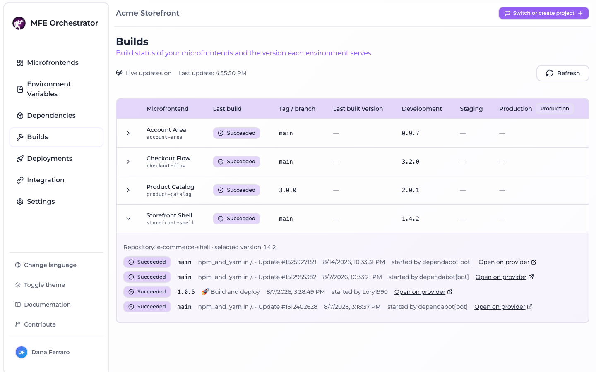

# Build status

Every microfrontend is built by the CI of the provider its repository lives on. Without a place
that collects those runs, checking whether the last pipeline passed means one browser tab per
repository.

The **Builds** page is that place: one row per microfrontend, the outcome of its latest run, the
recent history behind it, and the version each environment is currently serving.

:::info Nothing is stored
The runs are read from the providers when you open the page, and re-read while you keep it open.
MFE Orchestrator keeps no build history of its own, so the page shows what the providers show and
nothing more.
:::

## Reading the table

One row per microfrontend of the current project, sorted by name:

| Column | Content |
| --- | --- |
| **Microfrontend** | Name and slug |
| **Last build** | Status badge of the most recent run, or why no run could be read |
| **Tag / branch** | The ref that run was started from, tags included |
| **Last built version** | The most recent version whose bundle actually reached the platform |
| One column per environment | The version that environment serves, taken from its **active deployment** |

The environment columns come after the fixed ones, in the order the environments are configured on
the project, and the production one is flagged with a badge.

Three version columns sound redundant until an incident makes the difference matter:

- **Last built version** is the newest bundle uploaded to the platform.
- The **environment columns** are what a [deployment](./overview.md) froze. A deployment ships a
  fixed set of versions, so an environment keeps serving what it was given even after a newer
  bundle exists.
- Expand a row and a third one appears, the **selected version**: what the microfrontend currently
  points at, which is what the next deployment would pick up.

A newer *last built version* than the one in the production column is not a fault — it is the gap
between "built" and "deployed", and this page is where you see it.

Expanding a row also shows the repository the microfrontend is linked to and the **last five runs**
of that repository, newest first, each with its status, ref, workflow name, start moment, who
started it, and a link to the run on the provider.

## Status badges

Each provider describes a run in its own vocabulary; the console reduces all of them to six
buckets.

| Status | Meaning |
| --- | --- |
| `QUEUED` | Accepted but not started — including a GitLab pipeline waiting on a manual action |
| `RUNNING` | In progress |
| `SUCCESS` | Finished and passed (Azure `partiallySucceeded` counts as passed) |
| `FAILED` | Finished and failed, timed out, or failed to start |
| `CANCELED` | Canceled or skipped |
| `UNKNOWN` | The provider reported a state this platform does not know |

A run still in progress is always `RUNNING`, whatever result the provider left on it from a
previous attempt: GitHub and Azure DevOps both split the outcome over two fields, and the second
one only means something once the first says the run is over.

## When a row has no runs

A microfrontend without runs says why, instead of showing an empty history:

| Reason | Cause |
| --- | --- |
| `NO_REPOSITORY` | No code repository is connected to the microfrontend, or the connection is disabled |
| `REPOSITORY_NOT_FOUND` | It points at a code repository connection that no longer exists |
| `PROVIDER_ERROR` | The provider call failed — revoked token, network error, missing Azure configuration |

`PROVIDER_ERROR` is confined to the row that produced it: one unreachable provider never blanks the
page, and the row keeps its versions. A microfrontend whose repository is reachable but has never
run a pipeline carries no reason at all and an empty run list.

## Where the runs come from

The runs are read through the [code repository connection](../repositories/connect/github.md) the
microfrontend points at, with the token stored on that connection:

| Provider | Addressed by | Read from |
| --- | --- | --- |
| GitHub | The repository **name**, under the organization or user of the connection | `GET /repos/:owner/:repo/actions/runs` |
| GitLab | The repository **id** | `GET /projects/:id/pipelines` |
| Azure DevOps | The repository **id**, inside the organization and project of the connection | `GET /_apis/build/builds?repositoryId=…&repositoryType=TfsGit` |

Runs are read repository-wide: every workflow, pipeline or build definition attached to the
repository is in scope, and there is no way to select "the build pipeline" among them.

## Live updates

The page opens a Server-Sent Events stream and keeps it for as long as it stays open. The header
shows whether the stream is connected and the moment of the last snapshot received.

Two things are worth knowing about what "live" means here:

- The server re-reads the providers **every 15 seconds** and only sends a frame when something
  actually changed. No provider webhook is involved, so a run that starts is visible within 15
  seconds, not instantly.
- A snapshot is reused for 15 seconds and shared by everyone watching the same project, so
  **Refresh** inside that window returns the cached snapshot rather than hammering the provider.
  The *last update* moment is when the snapshot was read, which is how you tell a fresh one from a
  reused one.

A provider failure during a poll ends that round, not the connection: the last snapshot stays on
screen and the next poll retries.

## API

Both endpoints are authenticated and scoped to the project carried by the `Project-Id` header.

| Method | Path | Description |
| --- | --- | --- |
| `GET` | `/api/builds` | Current build status of the project, as one snapshot |
| `GET` | `/api/builds/stream` | The same snapshot, pushed over SSE as it changes |

Neither takes a query parameter or a body. The snapshot carries the environments of the project,
and for each microfrontend its `selectedVersion`, `latestBuiltVersion`, a
`versionByEnvironmentId` map and up to five `builds`; a microfrontend that could not be read
carries `unavailableReason` and an empty `builds`.

:::note `EventSource` cannot be used
The API requires an `Authorization` and a `Project-Id` header on every call, and `EventSource`
cannot send either. Consume the stream with `fetch`, as the console does.
:::

## Limits worth knowing

- Only the **last five runs** per microfrontend are read, and only for the repository as a whole.
- On Azure DevOps only builds of **Azure Repos Git** repositories are matched; a pipeline defined
  on a repository hosted elsewhere is not listed.
- Nothing is persisted: no trend, no duration, no failure rate.
- The status is at most 15 seconds old.
- A token without access to the CI of a repository yields `PROVIDER_ERROR` even when the repository
  itself is readable.

## Where to go next

- [Versions and builds](../microfrontends/versions-and-builds.md) — how a version comes into
  existence and reaches the platform
- [Deployments overview](./overview.md) — turning built versions into what an environment serves
