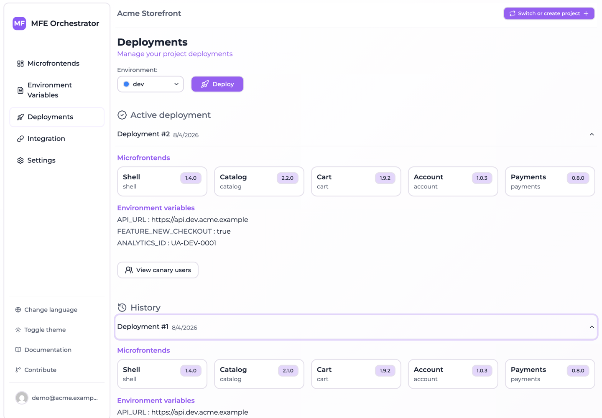

# Rollback and redeploy

Because deployments are immutable snapshots, rolling back is not a rebuild, a revert commit, or a
re-upload. It is re-activating a snapshot that already exists.

## Rolling back

1. Open **Deployments** and select the affected environment.
2. Find the last known-good deployment in **History**.
3. Expand it and check its microfrontend versions and variables are what you expect.
4. Choose **Redeploy** on that deployment.

Comparing the two snapshots above is the whole point: `#2` is serving `catalog` at `2.2.0`,
while `#1` — one click away — still holds `2.1.0`.

That deployment becomes active again, the broken one is deactivated, and the serve endpoints
immediately answer from the restored snapshot.

Because the microfrontend entry point is always served with
`Cache-Control: no-cache, no-store, must-revalidate`, browsers pick up the change on their next
request rather than after a cache expiry.

## What a rollback restores

Everything in the snapshot, together:

- Microfrontend versions
- Hosting configuration and entry points
- Canary settings
- Environment variables
- Storage configuration

This matters when an incident has more than one cause. If a bad release changed both a version
and a feature-flag variable, rolling back the deployment undoes both — you do not have to
remember which variables moved.

## What a rollback does not do

| Not restored | Why |
| --- | --- |
| Your project's draft configuration | The console keeps showing the versions and variables you last selected. Only the *active snapshot* changes |
| Deleted microfrontends | A microfrontend deleted from the project is gone from the project, even if older snapshots mention it |
| Data outside MFE Orchestrator | Database migrations, backend deployments and CDN state are yours to manage |

Point one is a common surprise: after a rollback, the console still shows the version you were
trying to ship, because that is still what you have selected. Reconcile the draft afterwards, or
your next deployment will re-ship the bad version.

:::tip After rolling back
Set the microfrontend's selected version back to the good one straight away. It costs ten seconds
and prevents the next deployment from re-introducing the incident.
:::

## Redeploying the current configuration

**Redeploy** on the *active* deployment re-activates the same snapshot with a fresh timestamp. It
does not pick up draft changes — for that, use **Deploy**, which takes a new snapshot.

Redeploying an already-active snapshot is occasionally useful as a no-op that refreshes serving
state, but if your goal is to publish edits, **Deploy** is the action you want.

## Deployment numbering

Numbers are assigned per environment and never reused: `#1`, `#2`, `#3` … A rollback does not
create a new number — it re-activates an existing one. So a history where `#7` is active after
`#9` existed is entirely normal, and tells you at a glance that a rollback happened.

## A rehearsal worth doing

Roll back once in a non-production environment before you need to do it under pressure:

1. Deploy a version, note the deployment number.
2. Bump the version and deploy again.
3. Redeploy the first snapshot and confirm your app serves the old version.

Ten minutes now buys confidence during an incident.
