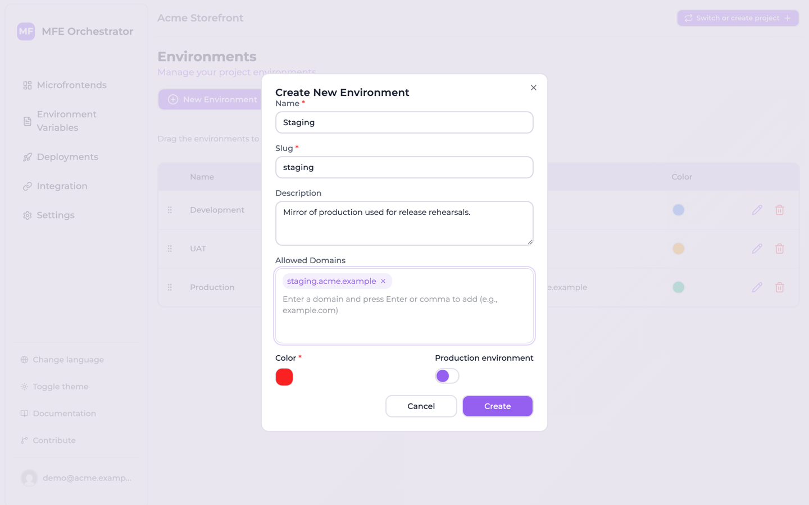
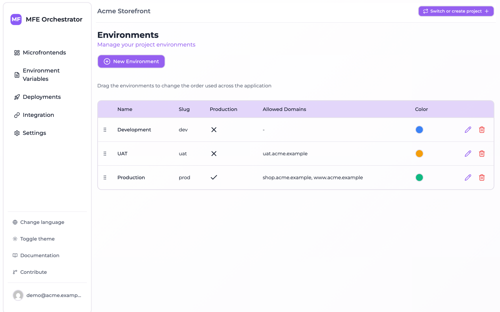

# Allowed domains and environment resolution

**Allowed Domains** is the least obvious field on an environment, and the one that unlocks the
cleanest integration. It lets MFE Orchestrator work out *which environment a browser request
belongs to* without the URL saying so.

## The problem it solves

Your host application needs to load remotes. The straightforward way is to build the environment
into the URL:

```
https://api.example.com/serve/mfe/files/<projectId>/prod/catalog/remoteEntry.js
                                                    ^^^^
```

That works, but it means the deployed artifact of your host differs per environment — the very
thing microfrontend architectures are supposed to avoid. You end up with an environment-specific
build, or with runtime string surgery in the host.

## How it works

Instead, register the domains each environment is served from:

| Environment | Allowed Domains |
| --- | --- |
| Development | `localhost`, `dev.example.com` |
| UAT | `uat.example.com` |
| Production | `example.com`, `www.example.com` |

Then use the environment-less form of the URL:

```
<API_BASE>/serve/mfe/files/auto/<projectId>/<microfrontendSlug>/<entryPoint>
```

When that request arrives, MFE Orchestrator reads the browser's `Referer` header and matches it
against the registered domains to find the environment, then answers from that environment's
active deployment.

One artifact, every stage. The host built once and deployed to `uat.example.com` gets UAT
remotes; the identical artifact on `example.com` gets production remotes.

## Adding domains

Open the environment and type a domain into **Allowed Domains**, pressing `Enter` or `,` after
each one. Add every hostname the environment is genuinely reachable at, including `www`
variants and any vanity domains.



The domains of every environment are visible together on the Environments page, which is the
quickest way to spot a stage that is still missing one:



## Which endpoints use it

Domain resolution applies to the endpoints that do not name an environment:

| Endpoint | Resolution |
| --- | --- |
| `/serve/mfe/files/auto/:projectId/:mfeSlug/*` | From `Referer` (falls back to the request host) |
| `/serve/mfe/files/:mfeId/*` | From `Referer` — **required** |
| `/serve/mfe/config/:mfeId` | From `Referer` — **required** |

Endpoints that name the environment explicitly — anything with `:environmentId` or
`:environmentSlug` in the path — ignore the domain list.

## Troubleshooting

**"Referer not found"**

The request arrived without a `Referer` header. This happens with `curl` unless you pass one, and
with strict referrer policies. Either send a `Referer`, or switch to an endpoint that names the
environment explicitly.

```bash
curl -H "Referer: https://example.com" \
  "<API_BASE>/serve/mfe/files/auto/<projectId>/catalog/remoteEntry.js"
```

**"Environment not found"**

The `Referer` did not match any environment's domain list in this project. Check for typos, and
remember that each domain must be registered on exactly one environment — overlapping lists make
resolution ambiguous.

**Local development**

Add `localhost` to your development environment. If you develop against a port, the origin is
matched too, so `http://localhost:3000` resolves via a `localhost` entry.

:::tip
Domain matching is case-insensitive and matches on the `Referer` and on its origin. Register
bare hostnames (`example.com`) rather than full URLs.
:::
