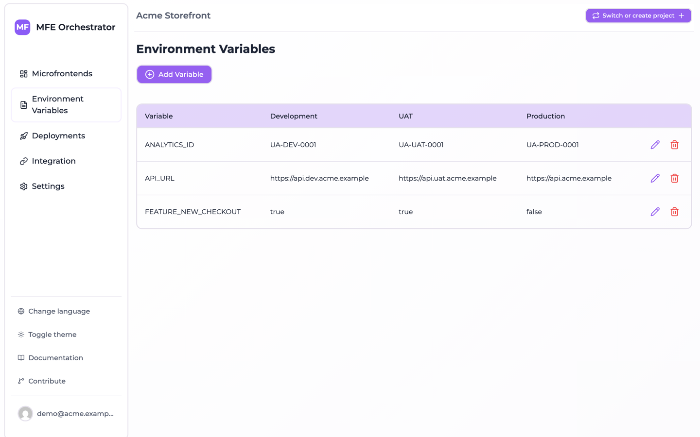
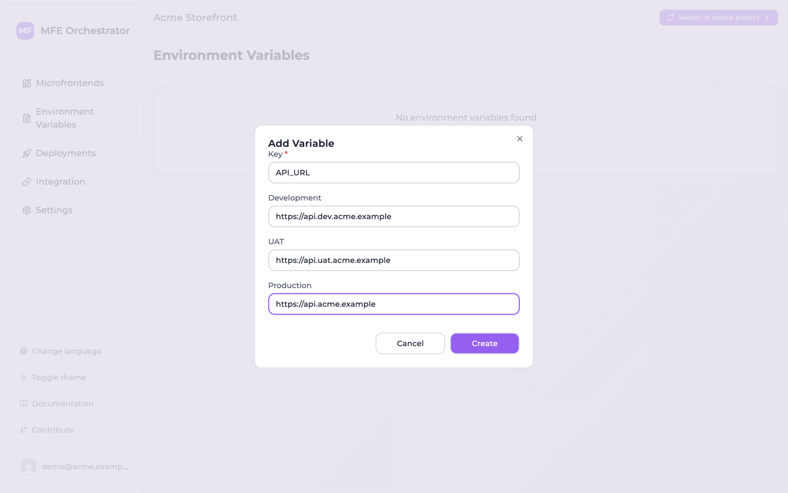

# Runtime environment variables

Environment variables in MFE Orchestrator are **runtime** configuration: `key`/`value` pairs
scoped to an environment, read by the browser after the bundle has loaded.

:::info Not to be confused with…
These are the variables of *your application*. The variables that configure the MFE Orchestrator
container itself are documented under
[Self Hosting → Environment Variables](../self-hosting/environment-variables.md).
:::

## Why runtime and not build time

A variable baked in at build time (`import.meta.env.VITE_API_URL`, `process.env.API_URL`) makes
the artifact environment-specific. Promoting a build from UAT to production then means rebuilding
it, which means the thing you tested is not the thing you shipped.

Serving the values at runtime instead means one artifact travels through every stage, and the
stage supplies its own configuration:

```
        one build of catalog@1.4.0
                   │
    ┌──────────────┼──────────────┐
    ▼              ▼              ▼
   dev            uat            prod
API_URL=…dev   API_URL=…uat   API_URL=…com
```

## Managing variables

Open **Environment Variables** in the sidebar and use **Add Variable**. Each variable is a `key`
with one value per environment; keys are unique per environment.



The dialog asks for the key once and then for its value in each environment, which is the shape
you almost always want — the same key with a different value per stage. Every environment has to get
a value: `value` is a required field on the model, so an empty box is rejected, and the values of all
environments are written in one batch — so a single empty box fails the whole variable rather than
creating it without that environment. The dialog validates nothing and starts with an empty box for
each environment, so pressing **Create** with one left blank returns a validation error and stores
nothing.

:::note Leaving a variable out of one environment
There is no way to do this from the console. The creation endpoint, though, writes only the
environments you send it: `POST /api/global-variables`, with the project in the `project-id` header
and a `values` array carrying no entry for one environment, creates the variable in every other
environment and leaves that one without it. That is where the code reading it genuinely finds
`undefined`.

Editing afterwards will not fill the gap: the update endpoint only rewrites rows that already exist,
and the console's delete removes the key from every environment at once. If the variable has to be
present everywhere, give it an empty-ish value your code treats as off rather than trying to omit
it.
:::



:::caution Not a secret store
Environment variables are served to the browser by a **public, unauthenticated** endpoint. Anyone
who knows your project and environment id can read them. Never put API secrets, private keys,
database credentials or tokens here. Use them for public configuration only: API base URLs,
feature flags, tracking ids, public keys.
:::

## Reading them in your application

Variables are exposed in two forms. The full details, including examples, are in
[Runtime configuration](../integration/runtime-configuration.md); in short:

**As a script that populates `window.globalConfig`** — add it to your `index.html` before your
bundle:

```html
<script src="<API_BASE>/serve/global-variables/auto/<projectId>/index.js"></script>
```

```js
const apiUrl = window.globalConfig?.API_URL
```

**As JSON**, if you prefer to fetch them yourself:

```js
const vars = await fetch('<API_BASE>/serve/global-variables/auto/<projectId>')
  .then(r => r.json())
```

Neither address names an environment: the platform resolves it from the domain the page is
served on, so one `index.html` covers every stage. The console's
**Integration → Environment variables** tab shows both snippets with your project id already
filled in.

## Variables and deployments

Like everything else, variables are captured in the deployment snapshot. Adding or changing a
variable does not affect a running environment until you deploy.

This is deliberate: it means a configuration change is as auditable and as reversible as a code
change. Rolling back a deployment rolls back its variables along with its versions.

:::tip
If you have changed a variable and your application still reads the old value, check that you
have deployed. Both variables endpoints above answer from the **active deployment** of the resolved
environment, never from the current draft configuration.

That is a property of the variables endpoints, not of the serve API as a whole: the routes that
stream microfrontend files resolve the deployment differently and can disagree with the active one
after a rollback — see
[Rollback and redeploy](../deployments/rollback-and-redeploy.md#the-file-routes-do-not-all-follow-a-rollback).
:::
