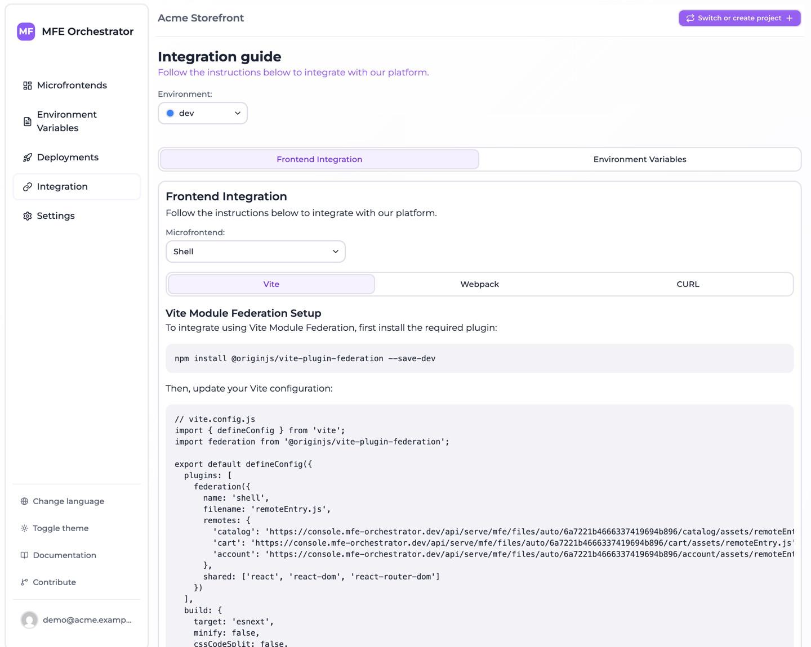

# Module Federation with Vite

MFE Orchestrator generates configuration for
[`@originjs/vite-plugin-federation`](https://github.com/originjs/vite-plugin-federation), the
Module Federation implementation for Vite. This is the setup used by the Vite templates in the
[templates library](../templates/templates-library.md).

## Install the plugin

In both hosts and remotes:

```bash
npm install @originjs/vite-plugin-federation --save-dev
```

## Configure a remote

A remote declares what it exposes. This does not involve MFE Orchestrator at all — it is ordinary
Module Federation:

```js
// vite.config.js
import { defineConfig } from 'vite'
import react from '@vitejs/plugin-react'
import federation from '@originjs/vite-plugin-federation'

export default defineConfig({
  plugins: [
    react(),
    federation({
      name: 'catalog',
      filename: 'remoteEntry.js',
      exposes: {
        './App': './src/App',
        './Button': './src/components/Button'
      },
      shared: ['react', 'react-dom']
    })
  ],
  build: {
    modulePreload: false,
    target: 'esnext',
    minify: false,
    cssCodeSplit: false
  }
})
```

:::caution Build settings are not optional
`target: 'esnext'` is required — Module Federation relies on top-level await. `minify: false` and
`cssCodeSplit: false` avoid known issues with the plugin's chunk rewriting. The templates ship
with these already set; if you configure a remote by hand, keep them.
:::

The built `remoteEntry.js` lands in `dist/assets/`, so set the microfrontend's **Entry Point** in
MFE Orchestrator to `assets/remoteEntry.js`.

## Configure the host

This is the part MFE Orchestrator generates. Open **Integration → Frontend integration**, select
your host, and copy the **Vite** tab:



```js
// vite.config.js
import { defineConfig } from 'vite';
import federation from '@originjs/vite-plugin-federation';

export default defineConfig({
  plugins: [
    federation({
      name: 'shell',
      filename: 'remoteEntry.js',
      remotes: {
        'catalog': 'https://console.mfe-orchestrator.dev/api/serve/mfe/files/auto/68f1.../catalog/assets/remoteEntry.js',
        'cart': 'https://console.mfe-orchestrator.dev/api/serve/mfe/files/auto/68f1.../cart/assets/remoteEntry.js'
      },
      shared: ['react', 'react-dom', 'react-router-dom']
    })
  ],
  build: {
    target: 'esnext',
    minify: false,
    cssCodeSplit: false,
    rollupOptions: {
      output: {
        minifyInternalExports: false
      }
    }
  }
});
```

The `remotes` block is derived from your relation graph: one entry per child of the selected host,
each pointing at a serve URL rather than a fixed CDN path.

Note what is **not** in those URLs: a version number and an environment. Both are resolved
server-side from the active deployment, which is why this configuration survives version bumps and
works unchanged across environments. See [Allowed domains](../environments/domains.md) for how the
environment is resolved.

## Remote names

The keys in `remotes` come from the microfrontend slug with `/` and `-` removed:

| Slug | Key to import from |
| --- | --- |
| `catalog` | `catalog` |
| `product-catalog` | `productcatalog` |
| `shop/catalog` | `shop_catalog` |

## Consume a remote

```jsx
import React, { Suspense, lazy } from 'react'

const CatalogApp = lazy(() => import('catalog/App'))

export default function App() {
  return (
    <Suspense fallback={<div>Loading…</div>}>
      <CatalogApp />
    </Suspense>
  )
}
```

For TypeScript, declare the remote modules — the plugin cannot generate types across the boundary:

```ts
// remotes.d.ts
declare module 'catalog/App' {
  const Component: React.ComponentType
  export default Component
}
```

## Shared dependencies

The generated host config shares `react`, `react-dom` and `react-router-dom`. Keep the shared list
consistent across every microfrontend in the graph: a library shared by the host but not by a
remote gets loaded twice, and for React that means broken hooks rather than a clear error.

If you share other libraries — a state manager, a design system — add them to the `shared` array
everywhere.

## Development

`vite dev` does not serve federated remotes: `@originjs/vite-plugin-federation` only emits
`remoteEntry.js` on `vite build`. To develop a host against a remote, either

- run `vite build && vite preview` in the remote, or
- point the host at the deployed remote in your development environment and let MFE Orchestrator
  serve it.

The second option is usually more pleasant — you develop the host against exactly what is
deployed, and only rebuild the remote you are actually changing.
