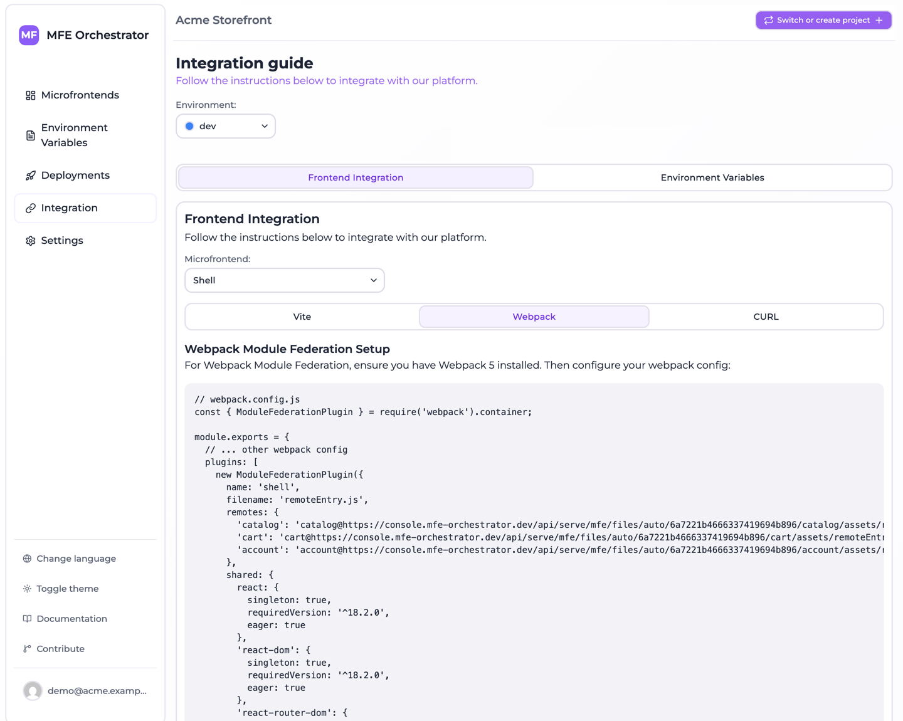

# Module Federation with Webpack

MFE Orchestrator generates configuration for Webpack 5's built-in
`ModuleFederationPlugin`. No extra dependency is needed — Module Federation ships with Webpack 5.

## Configure a remote

A remote declares what it exposes; this is plain Module Federation with no MFE Orchestrator
involvement:

```js
// webpack.config.js
const { ModuleFederationPlugin } = require('webpack').container;

module.exports = {
  // ... other webpack config
  plugins: [
    new ModuleFederationPlugin({
      name: 'catalog',
      filename: 'remoteEntry.js',
      exposes: {
        './App': './src/App',
        './Button': './src/components/Button'
      },
      shared: {
        react: { singleton: true, requiredVersion: '^18.2.0' },
        'react-dom': { singleton: true, requiredVersion: '^18.2.0' }
      },
    }),
  ],
};
```

Webpack writes `remoteEntry.js` to the root of your output directory, so the microfrontend's
**Entry Point** in MFE Orchestrator stays at the default of `remoteEntry.js` — unless you have
customised `output.publicPath` or the filename.

## Configure the host

Open **Integration → Frontend integration**, select your host and copy the **Webpack** tab:



```js
// webpack.config.js
const { ModuleFederationPlugin } = require('webpack').container;

module.exports = {
  // ... other webpack config
  plugins: [
    new ModuleFederationPlugin({
      name: 'shell',
      filename: 'remoteEntry.js',
      remotes: {
        'catalog': `promise import('@mfe-orchestrator-hub/client').then(m => m.remoteUrl('catalog'))`,
        'cart': `promise import('@mfe-orchestrator-hub/client').then(m => m.remoteUrl('cart'))`
      },
      shared: {
        react: {
          singleton: true,
          requiredVersion: '^18.2.0',
          eager: true
        },
        'react-dom': {
          singleton: true,
          requiredVersion: '^18.2.0',
          eager: true
        },
        'react-router-dom': {
          singleton: true,
          requiredVersion: '^6.15.0',
          eager: true
        }
      },
    }),
  ],
};

// ---------------------------------------------------------------------------
// Host bootstrap: paste this at the very top of your entry point (src/index.js).
// The remotes above ask the SDK for their url, so configure() has to run before
// anything imports one of them.
// Expose the three variables to the bundle with webpack.EnvironmentPlugin.
// ---------------------------------------------------------------------------
/*
import { configure } from '@mfe-orchestrator-hub/client'

configure({
  backendUrl: process.env.MFE_BACKEND_URL,
  projectId: process.env.MFE_PROJECT_ID,
  environment: process.env.MFE_ENVIRONMENT
})
*/
```

`promise <expression>` is how `ModuleFederationPlugin` declares a remote whose URL is only known at
runtime: the expression is inlined into your host bundle and awaited before the remote is used. The
URL comes from the [client SDK](./client-sdk.md), which is referenced by bare specifier and resolved
by your own bundler.

So the generated configuration contains **no URL** — no version, no environment, no CDN path. That is
what keeps the resolution server-side and lets a
[canary release](../microfrontends/canary-releases.md) decide which version this browser receives.
See [Allowed domains](../environments/domains.md) for how the environment is resolved.

Two things you have to do yourself:

```bash
npm install @mfe-orchestrator-hub/client
```

and uncomment the bootstrap block at the bottom into your entry point, before anything imports a
remote. `process.env.MFE_*` only reaches the bundle if you expose it — `webpack.EnvironmentPlugin`
is the shortest way.

:::note If you pin a remote by hand
Webpack's static remote syntax is `name@url`, not a bare URL as Vite uses. You will not see it in
the generated configuration any more, but it is what you need if you ever hard-code a remote —
along with the understanding that you have just frozen one version into your host.
:::

## Remote names

The remote name is derived from the slug by removing `/` and `-`:

| Slug | Key to import from |
| --- | --- |
| `catalog` | `catalog` |
| `product-catalog` | `productcatalog` |
| `shop/catalog` | `shop_catalog` |

## Consume a remote

```jsx
import React, { Suspense, lazy } from 'react'

const CatalogApp = lazy(() => import('catalog/App'))

export default function App() {
  return (
    <Suspense fallback={<div>Loading…</div>}>
      <CatalogApp />
    </Suspense>
  )
}
```

## About `eager: true`

The generated host configuration marks shared dependencies as `eager: true`, which bundles them
into the host's initial chunk instead of loading them asynchronously. This trades a larger initial
bundle for a simpler startup: no async boundary is required before your first import.

If you would rather keep the initial bundle small, drop `eager` and wrap your entry point in an
async boundary:

```js
// index.js
import('./bootstrap')
```

```js
// bootstrap.js
import React from 'react'
import { createRoot } from 'react-dom/client'
import App from './App'

createRoot(document.getElementById('root')).render(<App />)
```

This is the standard Module Federation pattern, and it is what you want in a production host with
a meaningful bundle-size budget.

## Version mismatches

`requiredVersion` with `singleton: true` makes Webpack warn at runtime when a remote wants a
different major version of a shared library than the host provides. Those warnings are worth
taking seriously — a satisfied-but-mismatched React is the source of most confusing microfrontend
bugs. Keep shared library versions aligned across the graph, and upgrade hosts and remotes
together.
