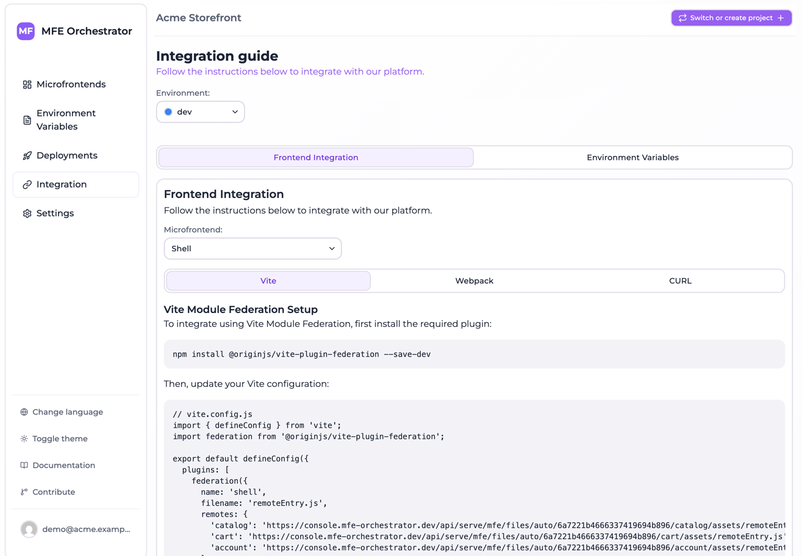

# Integration overview

So far everything has happened inside MFE Orchestrator. This section is about the other side:
how your application actually consumes what you deployed.

## The Integration page

**Integration** in the sidebar generates, for the selected environment, exactly the snippets your
project needs — with your project id, environment id and deployment already filled in. It has two
tabs:

| Tab | Contains |
| --- | --- |
| **Frontend integration** | Module Federation configuration for Vite and Webpack, plus a `curl` example |
| **Environment variables** | The snippets for reading runtime configuration in the browser |

The page requires the selected environment to have an active deployment. If it does not, deploy
first — there is nothing to integrate against until then.

Pick the **host** microfrontend from the selector at the top: the generated configuration is
always from the point of view of one host, listing its remotes.

## The two integration models

There are two quite different ways to consume MFE Orchestrator, and the right choice depends on
how dynamic you need to be.

### Generated bundler configuration

You copy the generated `remotes` block into your bundler configuration and build. What gets baked
into your host is not a URL: it is a call into the [client SDK](./client-sdk.md), which asks the
serve API for the URL of each remote at import time.

- Standard Module Federation, plus one `configure()` call in your entry point
- No version, no environment and no CDN path compiled in, so bumping a remote's version — or
  putting it behind a [canary release](../microfrontends/canary-releases.md) — is just a deployment
- Which remotes the host knows about is still fixed at build time: adding or removing one requires
  a host rebuild

This is what the **Vite** and **Webpack** tabs give you. Start here.

### Runtime discovery

Your host asks the serve API at boot which remotes exist and where they are, then registers them
dynamically.

- Adding a remote to a host needs no host rebuild — just a deployment
- Requires dynamic remote loading in your host, which Module Federation supports but does not do
  for you
- Costs one HTTP request during startup

This is what the `curl` tab hints at: a single call to `/serve/all/...` returns the whole
environment — microfrontends with URLs and versions, plus the environment variables. The SDK's
`manifest()` gives you the same thing without writing the fetch.

Most teams start with the generated configuration and move to runtime discovery when the roster of
remotes starts changing often.

## Inject in Repository

If the host's repository is connected to MFE Orchestrator, the Integration page shows an **Inject
in Repository** button next to the microfrontend selector. It writes the generated configuration
directly into the repository instead of leaving you to copy, paste and commit.

## What the platform serves

Whatever integration model you choose, these are the things your application can ask for — all
from the **active deployment** of the resolved environment:

| Ask | Endpoint family |
| --- | --- |
| Everything about this environment | `/serve/all/...` |
| Just the runtime variables | `/serve/global-variables/...` |
| One microfrontend's URL and version | `/serve/mfe/config/...` |
| A microfrontend's actual files | `/serve/mfe/files/...` |

These endpoints are **public and unauthenticated** — they are meant to be called from browsers.
The complete reference is in [Serve API](./serve-api.md).

Each family can be addressed either with the environment named in the path, or through an `auto`
form that carries only the project id and lets the platform resolve the environment from the
request's domain. The second is what makes one host build usable in every stage, and what the SDK
falls back to when `configure()` is called without an `environment` — at the cost of depending on
the [allowed domains](../environments/domains.md) being right.

## Where to go next

- [Client SDK](./client-sdk.md) — `@mfe-orchestrator-hub/client`, which the generated configuration
  delegates remote resolution to
- [Vite](./module-federation-vite.md) — `@originjs/vite-plugin-federation`
- [Webpack](./module-federation-webpack.md) — `ModuleFederationPlugin`
- [Runtime configuration](./runtime-configuration.md) — reading environment variables in the browser
- [Serve API](./serve-api.md) — the full public endpoint reference
