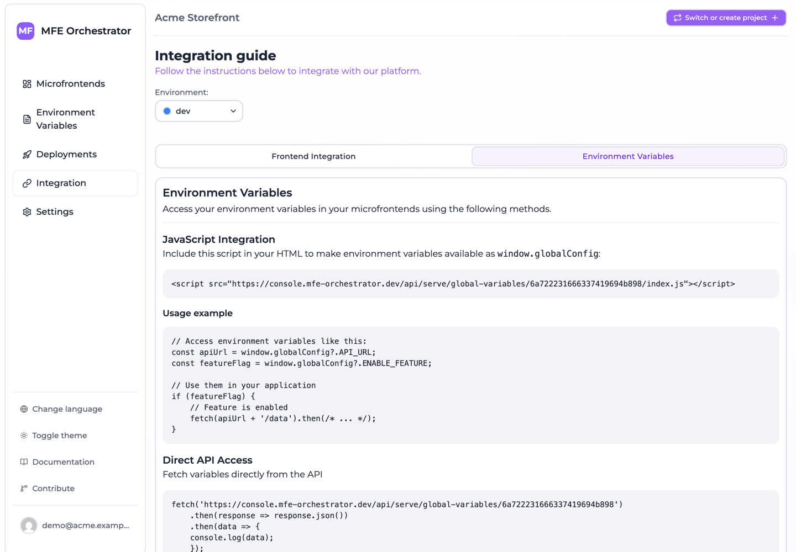

# Read runtime configuration in the browser

This page shows how to read an environment's [environment variables](../environments/environment-variables.md)
from the browser, so a single build can be configured differently in each stage.

The console generates both snippets with your ids already substituted, under
**Integration → Environment Variables**.



## Option 1: the generated script

MFE Orchestrator can serve your variables as a JavaScript file that assigns them to
`window.globalConfig`. Add it to your `index.html` **before** your application bundle:

```html
<!doctype html>
<html>
  <head>
    <script src="<API_BASE>/serve/global-variables/auto/<projectId>/index.js"></script>
  </head>
  <body>
    <div id="root"></div>
    <script type="module" src="/src/main.jsx"></script>
  </body>
</html>
```

The address names your project and no environment: the platform works out which one answers from
the domain the page is served on, so this `index.html` is the same file in every stage and a
promotion never means editing it. [Addressing an environment explicitly](#addressing-an-environment-explicitly)
covers the cases where you do want to name one.

The served file looks like this:

```js
window.globalConfig = {
  "API_URL": "https://api.example.com",
  "ENABLE_NEW_CHECKOUT": "true"
}
```

Then read it anywhere in your code:

```js
const apiUrl = window.globalConfig?.API_URL
const featureFlag = window.globalConfig?.ENABLE_NEW_CHECKOUT === 'true'

if (featureFlag) {
  fetch(apiUrl + '/checkout/v2')
}
```

Because the script is a blocking `<script>` in `<head>`, `window.globalConfig` is guaranteed to
exist by the time your bundle runs — no loading state, no race.

### Values are always strings

Everything comes back as a string, including `"true"`, `"false"` and `"0"`. Compare explicitly:

```js
// ✅
const enabled = window.globalConfig?.ENABLE_NEW_CHECKOUT === 'true'

// ❌ "false" is truthy
const enabled = Boolean(window.globalConfig?.ENABLE_NEW_CHECKOUT)
```

A small typed accessor is worth writing once:

```ts
// config.ts
declare global {
  interface Window {
    globalConfig?: Record<string, string>
  }
}

const raw = window.globalConfig ?? {}

export const config = {
  apiUrl: raw.API_URL ?? 'http://localhost:8080',
  newCheckout: raw.ENABLE_NEW_CHECKOUT === 'true',
}
```

The fallbacks keep local development working without a `<script>` tag pointing at a deployed
environment.

## Option 2: fetch the JSON

If you would rather control loading yourself:

```js
const vars = await fetch('<API_BASE>/serve/global-variables/auto/<projectId>')
  .then(r => r.json())
// [{ _id: '68f1…', key: 'API_URL', value: 'https://api.example.com',
//    environmentId: '68f2…', createdAt: '…', updatedAt: '…' }, …]
```

Always an array, and `key` and `value` are always on every entry — but the entries are not the same
shape at every address:

| Address | Entry shape |
| --- | --- |
| `/serve/global-variables/{environmentId}` | Exactly `{ key, value }` |
| `/serve/global-variables/{projectId}/{environmentSlug}` | The stored document: `key`, `value`, plus `_id`, `environmentId`, `createdAt`, `updatedAt` |
| `/serve/global-variables/auto/{projectId}` | The stored document, as above |
| `globalVariables` inside `/serve/all/…` | The stored document, as above |

Only the environment-id form maps the entries down to two fields. The other addresses — including the
`auto` form used above, and the one in the generated snippet — hand back the deployed documents as
they are stored. Read `key` and `value` and treat the rest as an implementation detail rather than a
contract. The conversion is the same either way:

```js
const config = Object.fromEntries(vars.map(v => [v.key, v.value]))
```

The trade-off is that your application now has an asynchronous startup dependency: everything that
reads configuration must wait for the fetch. Option 1 avoids that entirely, which is why it is the
default recommendation.

## How `auto` resolves

The `auto` address used by both snippets above carries no environment. The platform works out the
calling domain and matches it against the [allowed domains](../environments/domains.md) of each
environment.

It does not do that by relying on the browser to send the page it is loading from. Under the default
referrer policy a cross-origin `<script src>` sends only the *origin* in `Referer`, and a request
with no referrer at all — a `curl`, a preload, a page under a stricter policy — sends none. So the
backend tries several forms of the calling domain in turn and accepts a match against any of them:
the `Referer` as received, then its origin, its host and its hostname, falling back to the request's
`Host` header when there is no `Referer`. Registering the bare hostname, ex. `dev.example.com`,
satisfies all of them.

It only works if the domain is actually registered on the intended environment: an unregistered
domain has nothing to resolve against and the request fails rather than falling back to a default.

## Addressing an environment explicitly

Name an environment when `auto` cannot decide for you — one domain serving several environments, a
build whose stage is already known, a `curl` from a machine that is not the deployed host. The JSON
form takes a project id and an environment slug, which are more readable and stable than an object
id; the `index.js` form is addressed by environment id:

```
<API_BASE>/serve/global-variables/<projectId>/<environmentSlug>
<API_BASE>/serve/global-variables/<environmentId>
<API_BASE>/serve/global-variables/<environmentId>/index.js
```

The cost of naming an environment in an `index.html` is that the artifact stops being portable:
promoting the build to the next stage becomes an edit of that file, which is exactly what `auto`
exists to avoid. Prefer it for anything you ship.

## Where the values come from

Always from the **active deployment** of that environment — never from the draft configuration in
the console. A variable you have added but not deployed is not served. This is the same rule that
governs microfrontend versions, and it means a configuration rollback is just a
[redeploy](../deployments/rollback-and-redeploy.md).

## Security

:::caution Public endpoint
`/serve/global-variables/...` is unauthenticated. Anyone with your project and environment id can
read every variable in it. Put only public configuration here — API base URLs, feature flags,
tracking ids, public keys. Never secrets.
:::

If you need secrets in the browser, you do not: move the operation that needs them behind your own
backend.
