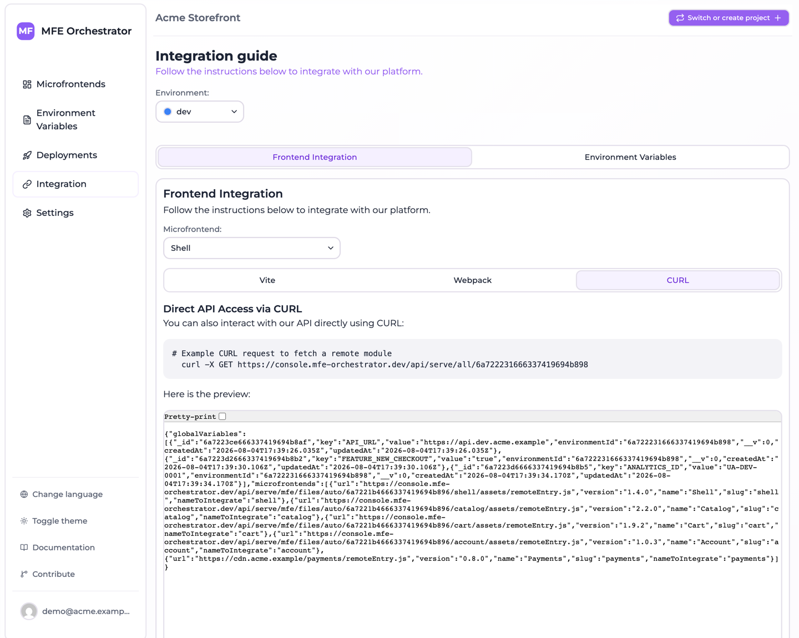

# Serve API reference

The serve API is the public, unauthenticated surface your applications talk to. Every endpoint
answers from the **active deployment** of the resolved environment.

All examples use `<API_BASE>`:

| Setup | `<API_BASE>` |
| --- | --- |
| Hosted console | `https://console.mfe-orchestrator.dev/api` |
| Self-hosted | `<FRONTEND_URL>/api`, or `BACKEND_URL` if set |

:::info No authentication
These endpoints are public by design — they are called from browsers, where a credential could not
be kept secret anyway. Do not put anything confidential in environment variables. The
[management API](../ci-cd/api-keys.md) is a separate, authenticated surface.
:::

## Addressing an environment

Most endpoints come in several flavours, differing only in how the environment is identified:

| Form | Environment resolved from |
| --- | --- |
| `.../<environmentId>` | Explicit object id |
| `.../<projectId>/<environmentSlug>` | Explicit project + slug — more readable, stable |
| `.../auto/<projectId>/...` or `/<mfeId>` | The request's `Referer`, matched against [allowed domains](../environments/domains.md) |

Prefer the slug form in configuration you write by hand, and the `auto` form when you want one
build to work in every environment.

The `auto` form is only as reliable as the domain list behind it: the host's real domain has to be
registered on exactly one environment of that project, otherwise the call answers
*Environment not found*. That is the trade the `auto` form makes — one artifact everywhere, in
exchange for a piece of configuration that lives in the console rather than in your build.

## Everything about an environment

```http
GET <API_BASE>/serve/all/{environmentId}
GET <API_BASE>/serve/all/{projectId}/{environmentSlug}
GET <API_BASE>/serve/all/auto/{projectId}                # Referer or Host
    ?mfeSessionId=<uuid>&mfeDeviceId=<uuid>&mfeUserId=<optional>
```

Returns the whole environment in one call: microfrontends with resolved URLs, and variables.

The third form names no environment at all: the caller says only which project it belongs to, and
the platform picks the environment whose allowed domains match the request. It is what the
[client SDK](./client-sdk.md) calls when `configure()` was given no `environment`, and what lets one
host build serve every stage.

```bash
curl "<API_BASE>/serve/all/68f1a2.../prod"
```

```json
{
  "globalVariables": [
    { "key": "API_URL", "value": "https://api.example.com" }
  ],
  "microfrontends": [
    {
      "url": "https://console.mfe-orchestrator.dev/api/serve/mfe/files/68f1.../prod/catalog/assets/remoteEntry.js",
      "slug": "catalog",
      "name": "Catalog",
      "nameToIntegrate": "catalog",
      "version": "1.4.0",
      "continuousDeployment": false
    },
    {
      "url": "https://console.mfe-orchestrator.dev/api/serve/mfe/files/68f1.../prod/checkout-new/_v/1.5.0-rc1/assets/remoteEntry.js",
      "slug": "checkout-new",
      "name": "Checkout",
      "nameToIntegrate": "checkoutnew",
      "version": "1.5.0-rc1",
      "continuousDeployment": true
    }
  ]
}
```

`nameToIntegrate` is the Module Federation remote name — the slug with `/` and `-` stripped. Use it
as the key when registering remotes dynamically.

`version` is the version this response actually resolves to, which is not necessarily the
deployment's version: a microfrontend running a
[canary release](../microfrontends/canary-releases.md) reports the version *this caller* gets.

`url` is resolved, and **already version-pinned when it needs to be**. The second entry above is on a
version-based canary, so the version appears as a `_v/<version>/` path segment. Use the string as it
is: never rebuild it, never strip that segment. The
[client SDK](./client-sdk.md) does this correctly for you.

It also names the environment this response resolved to, whichever of the three forms above asked
for it. The `auto` form therefore resolves the domain once, on this call: the file requests that
follow already know their environment, and work from a host whose domain is registered nowhere.

### Identity parameters

The three optional query parameters carry the identities a canary decision can be computed on:

| Parameter | Identity |
| --- | --- |
| `mfeDeviceId` | The browser — a *Session* canary buckets on this |
| `mfeUserId` | The logged-in user — a *User* canary looks this up in its enrolment list |
| `mfeSessionId` | The browsing session — no canary strategy is computed on it, it is there for your own telemetry |

Send every one you have. They are not cookies and cannot be: module scripts are fetched with a fixed
`same-origin` credentials mode, so the URL is the only channel — see
[canary releases](../microfrontends/canary-releases.md#who--the-canary-type). Omitting them is
supported: a *Session* canary then falls back to a draw per page load instead of a sticky one, and
a *User* canary serves the stable version to everyone.

This is the endpoint to build runtime discovery on: one request at boot gives you the full roster
and the configuration.

## Environment variables

```http
GET <API_BASE>/serve/global-variables/{environmentId}
GET <API_BASE>/serve/global-variables/{projectId}/{environmentSlug}
GET <API_BASE>/serve/global-variables/auto/{projectId}               # Referer or Host
GET <API_BASE>/serve/global-variables/{environmentId}/index.js
GET <API_BASE>/serve/global-variables/auto/{projectId}/index.js      # Referer or Host
```

The first three return JSON; the last two return JavaScript that assigns `window.globalConfig` and
is served as `application/javascript`, ready for a `<script src>` tag.

The `auto` form is the one to put in an `index.html`: it names no environment, so the same document
works in every one of them.

See [Runtime configuration](./runtime-configuration.md) for usage.

## One microfrontend's configuration

```http
GET <API_BASE>/serve/mfe/config/{projectId}/{environmentSlug}/{mfeSlug}
GET <API_BASE>/serve/mfe/config/{environmentId}/{mfeSlug}
GET <API_BASE>/serve/mfe/config/auto/{projectId}/{mfeSlug}   # Referer or Host
GET <API_BASE>/serve/mfe/config/{mfeId}                      # Referer required
```

Returns a single entry in the same shape as the items in `microfrontends` above — the resolved URL
and the deployed version.

Useful when a host wants to look up one remote lazily rather than fetching the whole environment.

## Microfrontend files

These endpoints stream the actual bundle files, and are what the URLs in your Module Federation
configuration point at.

```http
GET <API_BASE>/serve/mfe/files/{projectId}/{environmentSlug}/{mfeSlug}/{path}
GET <API_BASE>/serve/mfe/files/auto/{projectId}/{mfeSlug}/{path}    # Referer or Host
GET <API_BASE>/serve/mfe/files/{mfeId}/{path}                      # Referer required
```

`{path}` is the file inside the build, for example `assets/remoteEntry.js` or
`assets/index-4f2a.css`.

Each of the three forms also accepts a version pinned into the path, immediately before `{path}`:

```http
GET <API_BASE>/serve/mfe/files/auto/{projectId}/{mfeSlug}/_v/{version}/{path}
```

The platform resolves the version — from the pinned segment when present, otherwise from the active
deployment and any canary configuration — and fetches the bytes according to the microfrontend's
[hosting type](../microfrontends/hosting-options.md) — local disk, your bucket, or an external URL —
then streams them back. A pinned version is honoured only if that deployment can serve it: the
deployed version, or the configured canary version.

### The entry point redirect

When a microfrontend is running a version-based canary and its **entry point** is requested at a
*versionless* URL, the response is a `302` (uncacheable) to the same file under
`/_v/<resolved-version>/`. This exists as a fallback for callers holding a raw URL; the URLs handed
out by the manifest already carry the segment, so they never take the redirect.

The redirect is sufficient for an **ES module**, whose relative imports resolve against the URL after
redirects. It is not sufficient for a **classic script**: `document.currentScript.src` is the URL
*before* redirects, so a webpack build with `publicPath: 'auto'` would derive its chunk base from the
versionless URL and could mix two versions in one page. Take the manifest URL as it is and the
question does not arise.

### Version override

```http
GET <API_BASE>/serve/all/{projectId}/{environmentSlug}?mfeVersion=1.5.0-rc1
GET <API_BASE>/serve/mfe/files/auto/{projectId}/{mfeSlug}/{path}?mfeVersion=1.5.0-rc1
```

`mfeVersion` forces a specific version, which is how you look at a canary without waiting to be
drawn into it. It is accepted only when the value is one of the versions that deployment can serve,
so it cannot reach an arbitrary build.

### Headers

| Situation | Headers |
| --- | --- |
| The file is the microfrontend's **entry point** | `Cache-Control: no-cache, no-store, must-revalidate`, `Pragma: no-cache`, `Expires: 0` |
| Any other file | Cacheable |
| All files | `Cross-Origin-Resource-Policy: cross-origin`, `x-mfe-version: <version>` |

`Content-Type` is set from the extension for `.js`, `.css`, `.html` and `.xml`.

`x-mfe-version` names the version those exact bytes came from. It is the only thing a browser is ever
told about a canary, and the quickest way to check which side of a split a page landed on.

The entry point being uncacheable is what makes a deployment take effect promptly: browsers
re-fetch it, discover the new hashed chunk names inside, and load those from cache or network as
needed.

## Generated bundler configuration

```http
GET <API_BASE>/serve/code?framework={vite|webpack}&microfrontendId={id}&deploymentId={id}
```

Returns `{ "code": "..." }` containing the generated bundler configuration for that host — the same
text the Integration page displays.

The console's **CURL** tab shows the runtime-discovery call for the selected environment, with your
ids already substituted:



Unlike the rest of this page, this endpoint requires authentication. It is a convenience for
tooling, not something your application calls at runtime.

## Error responses

| Message | Cause |
| --- | --- |
| `Active deployment not found` | The environment has never been deployed, or has no active deployment |
| `Referer not found` | A domain-resolving endpoint was called without a `Referer` header |
| `Environment not found` | The `Referer` matched no environment's allowed domains |
| Entity not found for a slug/id | No such microfrontend or environment, or the microfrontend is absent from the active deployment |

A microfrontend that exists in the project but was added *after* the last deployment falls into the
last row: deploy the environment to include it.

## Building runtime discovery

Use the [client SDK](./client-sdk.md). It calls this endpoint for you, once per page load, with the
identity parameters generated and persisted, and returns URLs you can hand straight to your
federation runtime:

```js
// src/main.js
import { configure, remoteUrl, globalVariables } from '@mfe-orchestrator-hub/client'

configure({ backendUrl: API_BASE, projectId: PROJECT_ID, environment: ENV_SLUG })
// environment is optional: drop it and the SDK calls the auto form instead,
// letting the domain decide which environment answers.

window.globalConfig = await globalVariables()

const catalog = await remoteUrl('catalog')   // already version-pinned, use as is

await import('./App')
```

The generated bundler configuration already goes through `remoteUrl()`, so in most hosts there is
nothing to write beyond the `configure()` call.

If you do call the endpoint yourself, remember what the SDK was written to get right: generate and
persist a session id and a device id, send them on every manifest request, and pass each `url`
through untouched.

With this in place, adding a remote to the host is a deployment rather than a release: the roster
is discovered, not compiled in.
