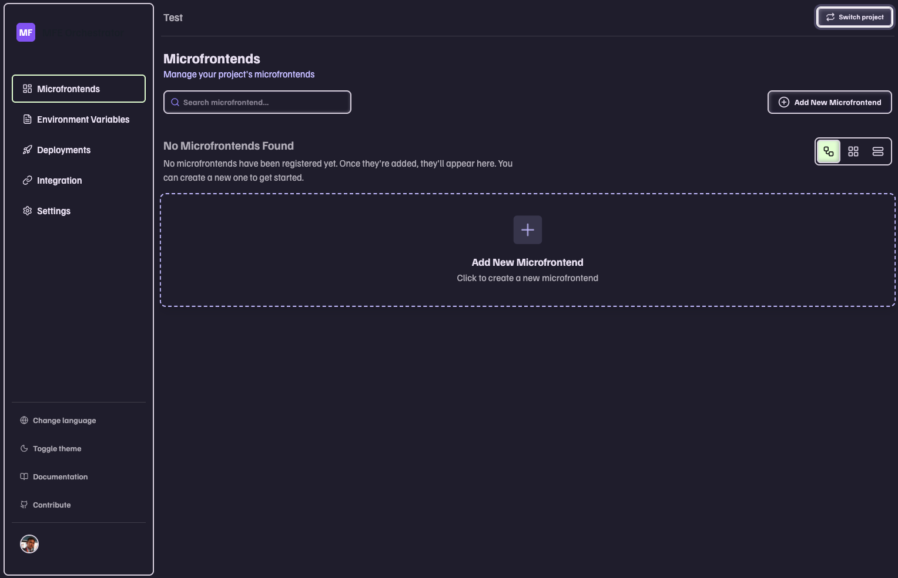
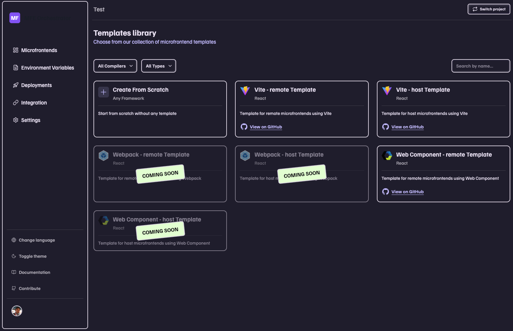
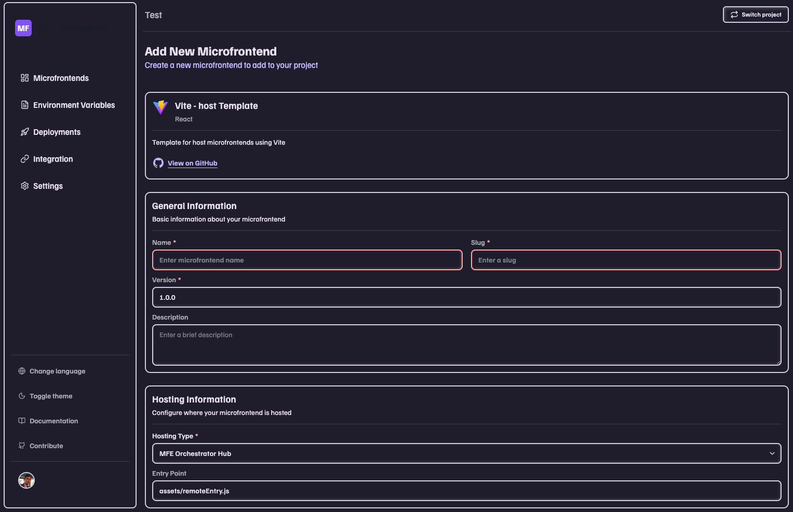

import Link from '@docusaurus/Link';

# Let's start

Welcome to MFE Orchestrator! This tutorial will guide you through your first steps with the platform.

**MFE Orchestrator can be used in two ways:**

  

    

      

        <h3>🌐 Online Console</h3>
        Recommended for Tutorial
      

      

        
Use our hosted version - no installation required!

        <ul>
          <li>✅ No setup needed</li>
          <li>✅ Always up to date</li>
          <li>✅ Perfect for getting started</li>
        </ul>
      

      

        <Link
          className="button button--primary button--block"
          to="https://console.mfe-orchestrator.dev" target="_blank">
          Go to console
        </Link>
      

    

  

  

    

      

        <h3>🔧 Self-Hosted</h3>
      

      

        
Deploy on your own infrastructure for full control.

        <ul>
          <li>✅ Complete control</li>
          <li>✅ Custom configuration</li>
          <li>✅ Production ready</li>
        </ul>
      

      

        <Link
          className="button button--secondary button--block"
          to="/docs/category/self-hosting">
          View Installation Options
        </Link>
      

    

  

In this tutorial, we'll use the **online console** available at [https://console.mfe-orchestrator.dev](https://console.mfe-orchestrator.dev) to explore MFE Orchestrator's features.

## Step 1: Access the Console & Register

Open your browser and navigate to:

**[https://console.mfe-orchestrator.dev](https://console.mfe-orchestrator.dev)**

To get started, you need to create an account. You have two options:

**Option 1: Register with Email**
1. Click on **"Register"** or **"Sign Up"**
2. Enter your email address and create a password
3. Verify your email
4. Sign in with your credentials
5. Set your first project name

**Option 2: Sign in with Google SSO**
1. Click on **"Sign in with Google"**
2. Select your Google account
3. Authorize MFE Orchestrator to access your basic profile
4. You'll be automatically signed in
5. Set your first project name

:::tip Recommended
Using Google SSO is faster and you don't need to remember another password!
:::

If you already have an account, simply sign in with your email or Google account.

## Step 2: Connect Your Code Repository

To deploy microfrontends, you need to connect MFE Orchestrator to your source code repository.

1. Navigate to **[Code Repositories](https://console.mfe-orchestrator.dev/code-repositories)** or click on **Settings** → **Code Repositories** in the main navigation menu
2. Click the **Add Repository** button

MFE Orchestrator supports multiple repository providers:

- **[GitHub](https://github.com)** - Most commonly used for public and private repositories
  - [See detailed setup guide →](/docs/repositories/connect/github)
- **[GitLab](https://gitlab.com)** - Self-hosted or GitLab.com
  - [See detailed setup guide →](/docs/repositories/connect/gitlab)
- **[Azure DevOps](https://dev.azure.com)** - Microsoft Azure Repos
  - [See detailed setup guide →](/docs/repositories/connect/azure.dev-ops)

:::tip Quick Start
For most users, we recommend starting with GitHub as it has the simplest setup process.
:::

## Step 3: Create Your First Microfrontend

Now you're ready to start working with microfrontends!

1. Return to the **[Home page](https://console.mfe-orchestrator.dev)** by clicking on the home icon or logo in the navigation menu
2. Click the **Add New Microfrontend** box at the center of the screen

3. Choose a template from the list

4. Fill in the required information
 * **name**: A descriptive name for your microfrontend
 * **slug**: A URL-friendly identifier (e.g., "my-app")
 * **source code provider**: Select the repository provider you connected in Step 2 (GitHub, GitLab, or Azure DevOps)
 * **repository name**: The name for the new repository that will be created

5. Click **Create** to finalize the setup

:::info Automatic Setup
MFE Orchestrator will automatically:
- ✅ **Create the repository** in your selected source code provider with the chosen template
- ✅ **Initialize the microfrontend** with all necessary configurations
- ✅ **Set up the deployment pipeline** ready for your first deployment

This process usually takes a few seconds. You'll see a success message once everything is ready!
:::

**Congratulations!** 🎉 You've successfully created your first microfrontend. You can now start developing, deploying, and managing your application through MFE Orchestrator.

