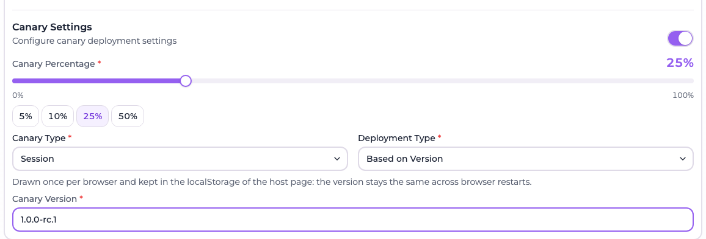
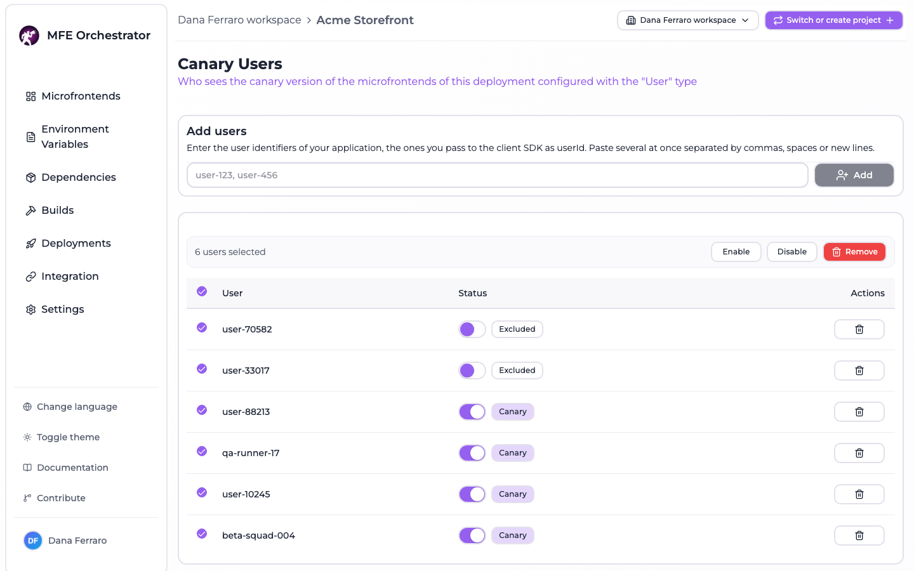

import ComingSoonBanner from '@site/src/components/ComingSoonBanner';

# Canary releases for microfrontends

<ComingSoonBanner feature="Canary releases">

Canary releases are **not usable yet**. In the console the **Canary release** section of the
microfrontend form and the **Canary users** page are both marked *Coming soon*, and their
controls are disabled — nothing on this page can be configured today.

The rest of this page describes the behaviour we are building, so you can plan for it. To roll
out progressively right now, use the [environment-based
rollout](#rolling-out-progressively-today) instead.

</ComingSoonBanner>

A canary release serves a new version of a microfrontend to a fraction of your traffic while
everyone else keeps the stable one. The plan is for MFE Orchestrator to do this per
microfrontend, without any change to your host application.

## Rolling out progressively today

Until canaries ship, the reliable way to do a progressive rollout with MFE Orchestrator is to
lean on environments:

1. Create an environment that mirrors production and point a subset of traffic at it via your
   own routing or DNS.
2. Deploy the candidate there.
3. Promote to production by deploying the same version to the production environment.

This uses only the deployment mechanics, which are fully implemented, and keeps rollback a
single [redeploy](../deployments/rollback-and-redeploy.md) away.

## The planned behaviour

Everything below is the design of the upcoming feature, not something you can switch on today.

### Enabling a canary

The microfrontend form has a **Canary release** section with an **Enable canary** switch. It is
disabled and marked *Coming soon*:

Once released it will configure two independent things: **who** gets the canary, and **what**
the canary is.

### Who — the canary type

| Type | Planned behaviour |
| --- | --- |
| **On sessions** | Each request is assigned to canary or stable according to the configured percentage |
| **On user** | Only users explicitly enrolled in the canary receive it |
| **Cookie based** | Assignment is driven by a cookie, so a returning visitor stays on the same side |

**Percentage** sets the share of traffic that should receive the canary.

### What — the deployment type

| Type | Planned behaviour |
| --- | --- |
| **Based on version** | The canary is a different **version** of the same microfrontend, resolved through the normal hosting configuration |
| **Based on URL** | The canary is a completely separate **URL**, which can point anywhere |

*Based on version* is the natural choice when the canary is simply the next build. *Based on URL*
is meant for candidates deployed on separate infrastructure — a preview environment, a different
CDN — that you want to send a slice of traffic to without registering as a version.

Depending on the choice, you fill in either **Canary version** or **Canary URL**.

### How it will take effect

Canary configuration is part of the microfrontend, so like everything else it is captured in a
[deployment](../deployments/overview.md) and only becomes live once you deploy.

At request time, when a host asks the serve API for its remotes, each microfrontend with canary
enabled resolves to either the canary URL or the stable URL. The host receives one URL per
remote and does not know which side of the split it got — no client-side logic is required.

### Canary users

For **On user** targeting, the enrolled users are managed per deployment, from
**Deployments → ⋯ → View canary users**. The page will list the users with access to the canary
version of that deployment. Today it shows a *Coming soon* notice — enrolment cannot be managed
from the console:

