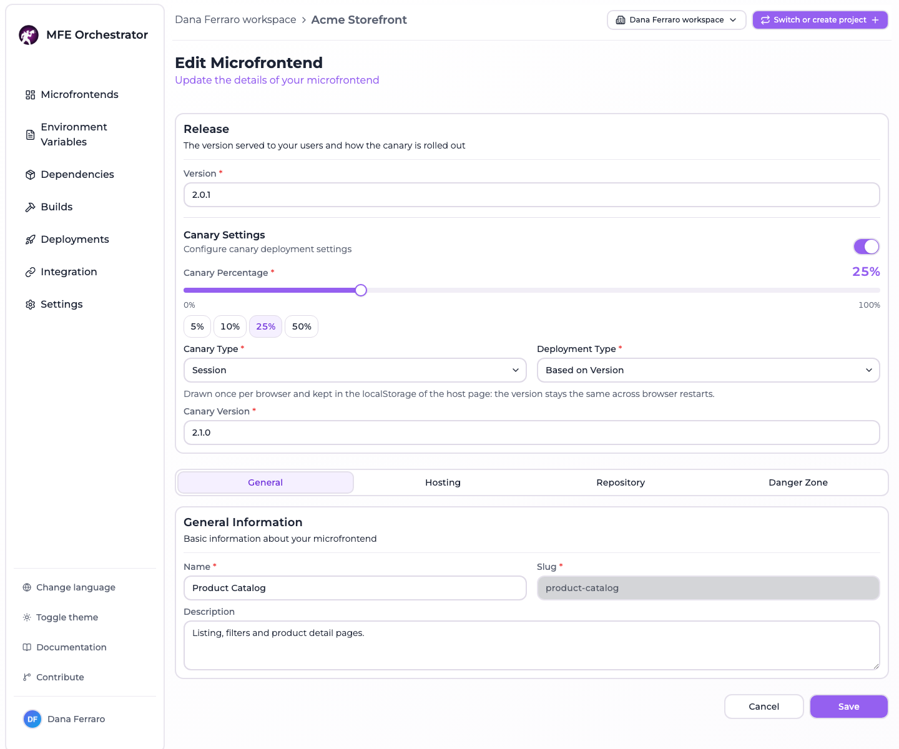

# Create a microfrontend

There are two ways to add a microfrontend to a project: start from a **template**, which
scaffolds a working repository and a build pipeline for you, or register a microfrontend whose
code already exists somewhere else.

## From a template (recommended)

This is the fastest path from nothing to a deployable microfrontend. MFE Orchestrator creates
the repository in your Git provider, fills it with a working Module Federation project, adds a
build-and-deploy pipeline, and injects the API key the pipeline needs to upload artifacts back
to the platform.

### Prerequisites

A connected code repository. If you have not connected one yet, follow
[GitHub](../repositories/connect/github.md), [GitLab](../repositories/connect/gitlab.md) or
[Azure DevOps](../repositories/connect/azure.dev-ops.md) first.

### Steps

1. From the **Microfrontends** page, click **Add New Microfrontend**. Next to it,
   **Import from repository** takes the other route, starting from code you already have.

   

2. Choose a template from the [templates library](../templates/templates-library.md), which opens
   as a page of its own. Templates are grouped by framework and filtered by framework, compiler
   and host type, so you can narrow down to, for example, *Vite + React + remote*. **Create From
   Scratch**, the first card, skips the template and leaves you with an empty repository.

   

3. Fill in the microfrontend details. The form is the same one you get when editing later, minus
   the danger zone: a **Release** card on top, then three tabs.

   **Release**

   - **Version** — required, the version this microfrontend starts on
   - **Canary Settings** — off by default, and there is no reason to turn it on while creating.
     See [canary releases](./canary-releases.md)

   **General**

   - **Name** — the display name
   - **Slug** — lowercase and URL-friendly; this ends up in your public URLs, so choose carefully
   - **Description** — optional

   **Hosting** — see [hosting options](./hosting-options.md)

   **Repository**

   - **Source Code Provider** — which connected repository the new repo is created in
   - **Repository Name** — the name of the repository to create. Availability is checked as you
     type
   - **Private Repository** — a switch. Off creates a public repository

   

4. Click **Save**.

### What happens behind the scenes

Creating from a template is not just a `git init`. MFE Orchestrator:

1. **Creates the repository** in the selected provider, under the user account, organization or
   group you chose.
2. **Downloads the template** archive and pushes its contents as the initial commit.
3. **Injects a build pipeline** matching your provider and compiler — a GitHub Actions workflow
   (`.github/workflows/build-and-deploy.yml`), a GitLab CI file (`.gitlab-ci.yml`) or an Azure
   DevOps pipeline (`azure-pipelines.yml`). The pipeline is pre-filled with your microfrontend's
   slug and the API base URL of this installation.
4. **Creates an API key** with the `MANAGER` role, valid for one year, and stores it in the
   provider as a secret named `MICROFRONTEND_ORCHESTRATOR_API_KEY` (on Azure DevOps, inside a
   variable group called `MFE_ORCHESTRATOR_SECRETS`). This is the credential the pipeline uses
   to upload build artifacts.
5. **Registers the microfrontend** in the project, linked to the new repository.

:::info
Because the deploy secret is created automatically, the generated pipeline works on its first
run — you do not have to copy any key by hand.
:::

## From scratch

Pick **Create From Scratch** in the templates library when the code already exists, or when you
want to bring your own project layout. You will be asked for the same general information, plus
the hosting configuration:

- **MFE Orchestrator Hub** — you will upload builds to the platform
- **Custom Source** — you will upload builds to your own bucket
- **Custom URL** — the files are already served from a URL you control

See [Hosting options](./hosting-options.md) for the details of each, and
[Versions and builds](./versions-and-builds.md) for how to get artifacts in.

You can optionally link an existing repository under **Code repository** — this enables the
**Build** action on the microfrontend card, but MFE Orchestrator will not add a pipeline to a
repository it did not create. To use the same automation, copy the relevant pipeline from the
[template-pipelines repository](https://github.com/mfe-orchestrator/template-pipelines) and
create an [API key](../ci-cd/api-keys.md) yourself.

## Editing a microfrontend

Clicking a microfrontend opens the same form in edit mode. **Release** sits at the top, outside the
tabs, because the version and the canary are what decide which bytes a browser gets; everything
else is behind a tab:

| Where | Contains |
| --- | --- |
| Release (above the tabs) | Version, and **Canary Settings** — progressive rollout, see [Canary releases](./canary-releases.md) |
| General | Name, slug, description, continuous deployment |
| Hosting | Hosting type, entry point, storage or URL |
| Repository | The linked repository |
| Danger Zone | Delete this microfrontend |

Switching tab keeps what you typed: every panel stays mounted, so a value entered under **Hosting**
survives a detour through **General**. A tab whose fields failed validation is marked with a dot,
and submitting an invalid form jumps to the first one — an error is never hidden behind an inactive
tab.

Remember that edits take effect for your users only after the next
[deployment](../deployments/overview.md).
