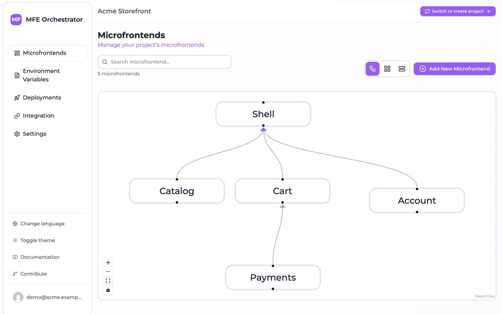

# Hosts and remotes in Module Federation

A microfrontend architecture is only an architecture once the pieces know about each other.
This page covers how MFE Orchestrator models those relationships, and what it does with them.

## The relation graph

Every microfrontend can have **parents** — the hosts that load it. In the **Diagram view** on
the Microfrontends page, relations are the arrows between nodes; you create and remove them
there directly.

A typical setup looks like this:

```
        shell  (host)
       ╱   │   ╲
 catalog  cart  account   (remotes)
              ╲
             payments     (remote of a remote)
```

In the console the same graph looks like this — `payments` is a remote of `cart`, which is
itself a remote of `shell`:



Nothing stops a remote from being a host of other remotes, and nothing stops a remote from
having several parents — a shared design-system remote consumed by three hosts is a perfectly
normal shape.

## Why the graph matters

The graph is what lets MFE Orchestrator generate your Module Federation configuration. When a
host asks the platform for its remotes, the answer is computed as:

> all microfrontends in the **active deployment** whose parents include this host

and each of them is resolved to a concrete URL, based on that microfrontend's hosting type and
the version frozen in the deployment.

The consequence worth internalising: **your host's build configuration does not contain version
numbers or URLs**. It contains the remote names, and the URLs come from the deployment. Bumping
a remote from `1.3.0` to `1.4.0` in production is a deployment, not a host rebuild.

## Remote naming

Module Federation remote names cannot contain `/` or `-`, so MFE Orchestrator derives the name
from the slug by stripping them:

| Slug | Remote name |
| --- | --- |
| `catalog` | `catalog` |
| `product-catalog` | `productcatalog` |
| `shop/catalog` | `shop_catalog` |

This derived name is what appears in the generated config and what you use in your `import`
statements:

```js
const Catalog = React.lazy(() => import('productcatalog/App'))
```

:::tip
Prefer slugs without dashes when you can. `catalog` reads better than `productcatalog` in your
imports, and there is no ambiguity about what the remote name will be.
:::

## Getting the configuration

Once the graph is set up and the environment is deployed, open **Integration** in the sidebar,
select the host microfrontend, and copy the generated configuration for your bundler. See:

- [Vite](../integration/module-federation-vite.md)
- [Webpack](../integration/module-federation-webpack.md)

For hosts whose repository is connected, the **Inject in Repository** button writes the
configuration straight into the repository instead of asking you to copy and paste.

## Shared dependencies

The generated configurations mark `react`, `react-dom` and `react-router-dom` as shared
singletons. This is what prevents two copies of React from being loaded — a failure mode that
produces confusing hook errors rather than an obvious crash.

If your microfrontends share other libraries — a state manager, a design system, a date library
— add them to the `shared` block in every participating microfrontend, hosts and remotes alike.
The generated config is a starting point, not a final answer; keep the shared list in sync
across the graph.
