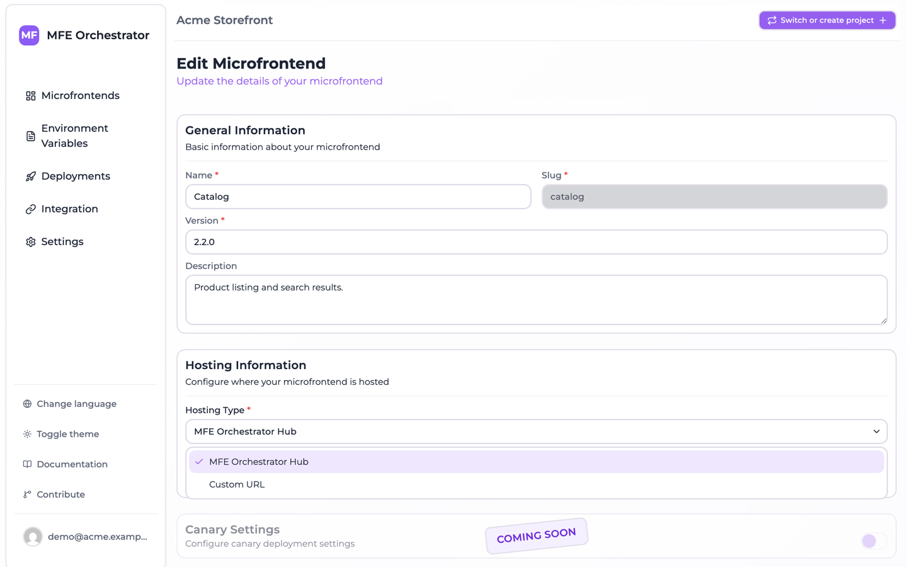

# Microfrontend hosting options

Every microfrontend declares **where its files live**. This is the *hosting type*, set under
**Hosting information** on the microfrontend form. It determines how MFE Orchestrator resolves
a request for `remoteEntry.js` into actual bytes.

There are three options.



:::note
**Custom Source** only appears in the list once the project has at least one
[storage](../buckets/overview.md) configured.
:::

## MFE Orchestrator Hub

The platform stores the build itself. You upload a ZIP of your `dist` folder and MFE
Orchestrator extracts and serves it.

- **Best for**: getting started, internal tools, self-hosted installations where you already
  own the disk.
- **Where files land**: on the server filesystem, under
  `<MICROFRONTEND_HOST_FOLDER>/<projectSlug>-<projectId>/<microfrontendSlug>/<version>/`.
  `MICROFRONTEND_HOST_FOLDER` defaults to `/var/microfrontends` — see
  [Environment Variables](../self-hosting/environment-variables.md).
- **Upload with**: the [upload endpoint](../ci-cd/manual-upload.md), used by the generated
  pipelines.

:::caution Self-hosting and persistence
When self-hosting, mount `MICROFRONTEND_HOST_FOLDER` on a persistent volume. In the reference
`docker-compose.yaml` this is the `upload_microfrontends` volume. Without it, every container
restart loses your uploaded builds.
:::

## Custom Source (your own bucket)

The platform stores the build in an object storage bucket **you** own — Amazon S3, Azure Blob
Storage or Google Cloud Storage — and streams files from there on request.

- **Best for**: production, compliance requirements, keeping artifacts inside your own cloud
  account.
- **Requires**: a configured [storage](../buckets/overview.md), selected on the microfrontend.
- **Where files land**: inside the bucket, under
  `<storage path>/<projectSlug>-<projectId>/<microfrontendSlug>/<version>/`. The optional
  storage-level `path` lets several projects share one bucket without colliding.
- **Upload with**: the same [upload endpoint](../ci-cd/manual-upload.md) — the platform routes
  the artifact to your bucket for you.

Your bucket does **not** need to be public. Files are fetched server-side with the credentials
you configured and streamed to the browser through the serve API.

## Custom URL

The files are already published somewhere — a CDN, an existing static host, another team's
infrastructure — and you just want MFE Orchestrator to keep track of versions and hand the
right URL to your host application.

- **Best for**: microfrontends you do not build, or an existing CDN setup you do not want to
  change.
- **Requires**: a base URL.
- **Upload**: not supported. Uploading to a Custom URL microfrontend is rejected; publishing is
  entirely your responsibility.

### URL placeholders

The URL may contain placeholders, substituted at request time:

| Placeholder | Replaced with |
| --- | --- |
| `$version` | The version from the active deployment |
| `$microfrontendSlug` | The microfrontend's slug |
| `$projectId` | The project id |
| `$projectSlug` | The project slug |

For example:

```
https://cdn.example.com/mfe/$microfrontendSlug/$version/remoteEntry.js
```

`$version` is what makes this option useful: switching a version in the console and deploying
is enough to point your users at different files on your CDN, with no rebuild of the host.

## Choosing between them

| | Hub | Custom Source | Custom URL |
| --- | --- | --- | --- |
| Who stores the files | MFE Orchestrator | You (bucket) | You (anywhere) |
| Upload via API/CI | ✅ | ✅ | ❌ |
| Artifacts stay in your cloud | ❌ (unless self-hosted) | ✅ | ✅ |
| Setup effort | None | Bucket + credentials | Publish pipeline of your own |
| Version switching | ✅ | ✅ | ✅ (via `$version`) |

## Entry point

Whatever the hosting type, the **Entry Point** field names the file consumers load. It defaults
to `index.js`, but Module Federation builds usually produce something else:

| Build setup | Typical entry point |
| --- | --- |
| Vite + `@originjs/vite-plugin-federation` | `assets/remoteEntry.js` |
| Webpack Module Federation | `remoteEntry.js` |

The entry point gets special cache treatment: it is always served with
`Cache-Control: no-cache, no-store, must-revalidate`, while the hashed assets around it are
cacheable. That is what allows a deployment to take effect immediately without stale chunks.

All served files also carry `Cross-Origin-Resource-Policy: cross-origin`, so a host on a
different origin can load them.
