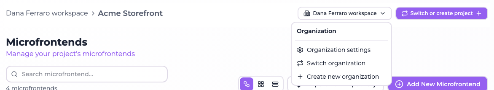
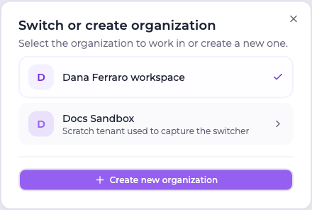
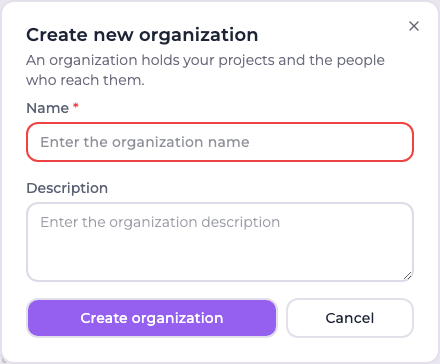
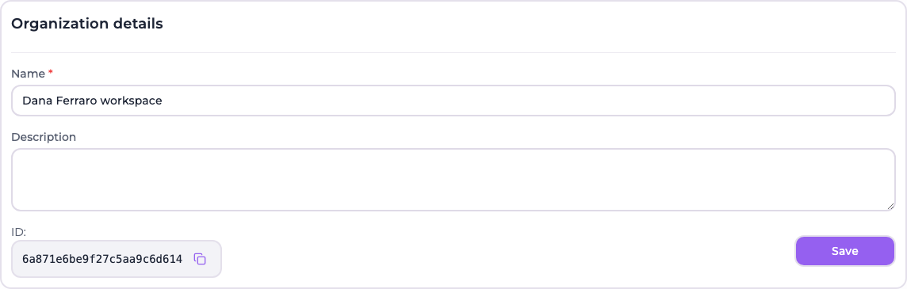
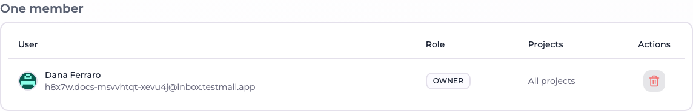
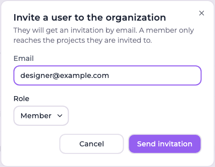
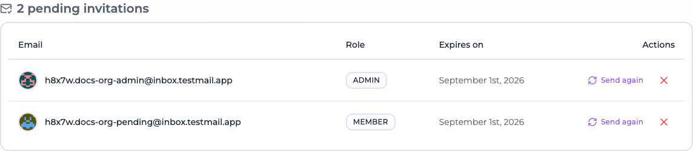
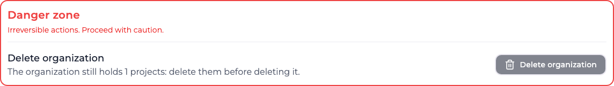

# Managing an organization

Everything at organization level starts from one button in the console header. The sidebar is
entirely about the project; the organization has a single door.

## The header menu

The header reads *organization › project*, and both parts are useful:

| Element | What it does |
| --- | --- |
| The organization name in the breadcrumb | Links straight to the organization page |
| **Organization settings** | The same page: details, members and danger zone |
| **Switch organization** | Opens the picker |
| **Create new organization** | Opens the creation form directly, skipping the list |

## Switching organization

**Switch organization** opens a dialog listing the organizations you belong to, with a search field
for accounts that belong to many.

Any organization invitation still waiting for an answer is offered above the list — accepting one
adds it to the list right there.

What happens to the project you were working in is the part worth understanding: **the project does
not follow you**. It belongs to the organization you are leaving, so it is dropped and forgotten,
and the project list is refetched for the organization you arrived in. What gets selected there is
decided in one order, always the same:

1. the project already in use, if it belongs to this organization — which after a switch it never
   does, but it is what makes an ordinary refetch leave your selection alone;
2. otherwise the project this browser remembers for this organization from a previous visit;
3. otherwise, if the organization holds exactly **one** project, that one, automatically;
4. otherwise nothing is selected, and the project picker asks.

:::info Accepting an invitation can move you
The project switcher also lists project invitations you have not answered yet, naming the
organization a project belongs to when it is not the one you are in. Accepting such an invitation
switches you to that organization — the console works inside one at a time, so staying put would
hand you a project list that does not contain the project you just accepted.
:::

:::tip A project shown under the wrong organization is a bug, not a mode
The header always names the organization the current project belongs to. If you ever see a project
listed under an organization that does not own it, you are on a build older than 4.0.0 — the race
that caused it was fixed there.
:::

## Creating an organization

**Create new organization**, from the header menu or from the button at the bottom of the picker,
opens the form directly.

| Field | Notes |
| --- | --- |
| **Name** | Required, at least 2 characters |
| **Description** | Optional |

Whoever creates an organization becomes its **owner** — an organization with no owner could never be
administered. The console switches into the new organization as soon as it is created, which means
no project is selected yet and the project wizard opens.

## The organization page

`/organization` is the organization's own page. It is headed **Organization members**, but it
carries three things: the **Organization details** card, the membership tables, and the one
irreversible action on the organization.

:::info The old address still works
Until 4.0.0 this page lived in the sidebar at `/organization-users`. That path now redirects to
`/organization`, so existing links and bookmarks keep working.
:::

### Details

| Field | Notes |
| --- | --- |
| **Name** | Editable by owners and admins. Renaming updates the header and the switcher immediately |
| **Description** | Optional; clearing the field removes it |
| **ID** | Read-only, with a copy button. This is the stable identifier — it survives renaming |

A plain member sees the name and the description as text, with no form and no save button.

### Members

The table has one row per accepted member:

| Column | Meaning |
| --- | --- |
| **User** | Name and email, or the email alone for an account that has not filled in a name |
| **Role** | A selector for owners and admins, a badge for everybody else |
| **Projects** | *All projects* for owners and admins, the number of projects reached for a member |
| **Actions** | Remove the member from the organization |

Changing a role commits as soon as you pick it — there is no save button on that selector. The
**last owner** is shown as a badge instead of a selector, and their remove button is rendered but
disabled: they cannot be demoted or removed until somebody else is made an owner.

Removing a member asks for confirmation and, as the dialog says, takes their access to **every
project of the organization** with it.

### Inviting a member

**Invite user**, at the top right of the page, is available to owners and admins.

Enter an email address, choose a role, and **Send invitation**. If the address has no account yet,
one is created in an invited state and the invitation email walks them through setting a password —
[the screen they land on](../account/email-flows.md#accepting-an-invitation) asks for it.

Invitations wait for an answer in their own table:

| Action | Effect |
| --- | --- |
| **Send again** | Issues a fresh token and sends the email again — the classic case of it landing in spam |
| **Revoke invitation** | Drops the invitation; the link stops working and a new one can be sent |

The **Expires on** column is the deadline: invitations are valid for five days.

:::info Email delivery is required
Organization invitations are delivered by email, exactly like project invitations, so the
installation needs SMTP configured. On an installation with no email channel the invited user is
added to the organization straight away instead — a confirmation link that cannot be delivered would
leave them stuck. See [Environment Variables](../self-hosting/environment-variables.md).
:::

### Danger zone

Only an **owner** sees this section, and deleting an organization is deliberately not a cascade: an
organization holds every project of a tenant, and wiping all of them behind one click is not
something a confirmation dialog can make safe.

So the action is refused while the organization still holds projects, and says so before you try it.
Delete the projects first, one at a time, where
[each project's own danger zone](../project-settings/projects.md#deleting-a-project) spells out what
is being lost. Once the organization is empty, deleting it asks you to type its name to confirm and
removes the organization and its memberships.

:::caution What deletion does not touch
Deleting an organization removes the organization and its membership rows. The user accounts
themselves, and their membership of other organizations, are unaffected.
:::
