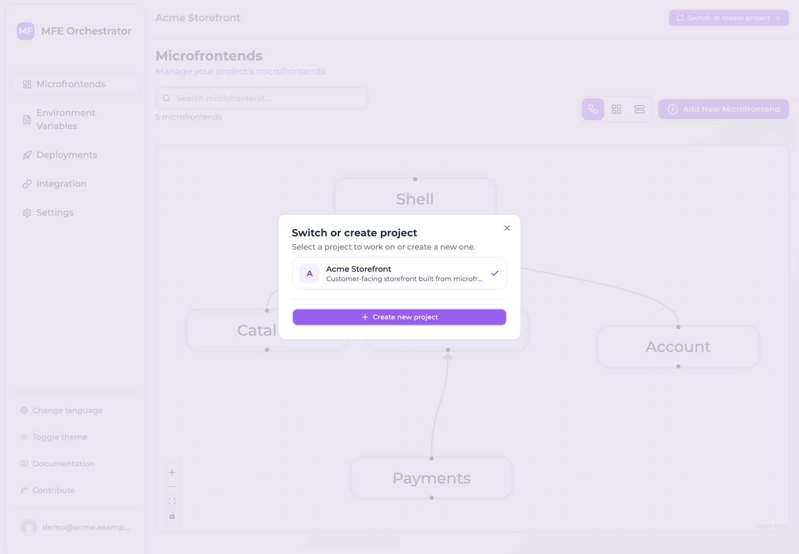
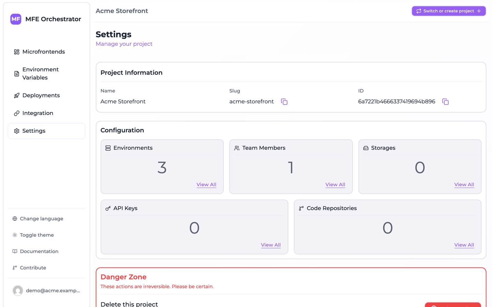

# Projects and access control

A **project** is the container every configuration object belongs to: microfrontends, environments,
storages, code repositories, API keys and members all belong to exactly one project.

The project in turn belongs to exactly one **organization**, which is the tenant that owns it and
the level deciding who reaches the project at all. See
[Organizations](../organizations/overview.md).

## What belongs in one project

A good rule of thumb: **one project per application**, where an application is a set of
microfrontends deployed together and sharing a host.

Signs you want a second project rather than a bigger one:

- The microfrontends are never deployed together
- Different teams should not see each other's configuration
- The release cadences are unrelated
- The environments genuinely differ (not just in values, but in which environments exist)

Signs you want one project:

- A shared host loads all of them
- They are promoted through the same stages
- The same people manage all of them

Bear in mind that microfrontends can only be wired into a host graph *within* a project, and API
keys are project-scoped. Splitting an application across projects means losing the relation graph
that generates your Module Federation configuration — usually not worth it.

## Creating a project

Your first project is created during onboarding: after registering you are asked to create an
[organization](../organizations/overview.md#your-first-organization), and the project wizard opens
inside it.

Additional projects are created through the **project wizard**, which has five steps:

1. **Name** — the project name, and a description. The name is required, at least three characters,
   and the slug is derived from it.
2. **Environments** — pick from a set of default stages, or define your own
3. **Storage** — connect a bucket for the artifacts, or skip
4. **Repositories** — connect a code repository, or skip
5. **Collaborators** — type the email addresses to invite, with a role each, or skip. They receive an
   email invitation, exactly as from
   [Members and roles](./users-and-roles.md#inviting-a-member).

The last three steps are skippable, and every one of them can be done later from **Settings**.

:::caution Leaving the wizard halfway creates a half-configured project
The project row is created the moment you complete step 1, before any environment exists. Nothing
remembers where you were: the step you are on is component state, with no draft saved anywhere, so
closing the wizard or reloading the page starts a fresh one — and completing that fresh one creates a
**second project**, leaving the first behind with whatever it had at the time.

If it happens, delete the abandoned project from its own
[Danger Zone](#deleting-a-project) rather than trying to resume it.
:::

The project is created inside the organization you are currently working in, and it stays there:
a project cannot be moved to another organization afterwards.

:::caution Only organization owners and admins can create a project
A plain member of an organization reaches the projects they were invited to and nothing else, so the
wizard is not offered to them at all. See
[Roles and project visibility](../organizations/roles-and-visibility.md).
:::

## Switching projects

The project selector sits in the console header, next to the
[organization selector](../organizations/managing-an-organization.md#the-header-menu). Everything
below it — microfrontends, deployments, settings — follows the selection.



The list only ever offers projects of the organization you are in. If a page looks empty, check the
selected project — and the selected organization — before anything else. It is the most common cause
of "my microfrontends disappeared".

## Project settings

**Settings** in the sidebar is the project's control panel. It shows a configuration summary with
counts, linking through to each area:

| Card | Leads to |
| --- | --- |
| Team Members | [Members and roles](./users-and-roles.md) |
| Environments | [Environments](../environments/overview.md) |
| API Keys | [API keys](../ci-cd/api-keys.md) |
| Storages | [Buckets](../buckets/overview.md) |
| Code Repositories | [Code repositories](../repositories/connect/github.md) |

### Project information

Under **Project Information** you will find:

| Field | Notes |
| --- | --- |
| **Name** | Editable display name. Required, at least two characters |
| **Description** | Editable free text |
| **Slug** | Read-only. URL-friendly identifier, part of storage paths. Copyable |
| **ID** | Read-only. The project id used in API calls and public serve URLs. Copyable |

The **ID** is what you need for the serve API and for `project-id` headers — this is where to copy
it from.



### Renaming a project

Edit the **Name**, then **Save**. The name and the description are one form and are saved together,
so an edit to either writes both.

The **Slug** does not follow the name, and cannot be edited at all. It is baked into the storage path
of every bundle already uploaded — see the caution below — so re-deriving it from a new name would
leave those files where nothing looks for them. A renamed project keeps the slug it was created
with, which is worth knowing when you audit a bucket and find a path naming a project that no longer
goes by that name.

:::caution The slug is part of your storage paths
Artifacts are stored under `<projectSlug>-<projectId>/…`. The id keeps paths unique regardless, but
be aware the slug appears in bucket paths when auditing storage.
:::

## Deleting a project

**Settings → Danger Zone → Delete Project** removes the project and everything scoped to it, in one
transaction: microfrontends, environments, variables, deployments and their history, API keys, member
and invitation rows, **storage connections**, **code repository connections**, the record of every
built frontend uploaded for those microfrontends, and any
[canary user enrolment](../microfrontends/canary-releases.md) on those deployments.

You must type the project name to confirm. There is no undo and no soft delete.

What is *not* deleted:

- Files already stored in **your own buckets** — the storage connection goes away, the objects stay
- **Git repositories** created from templates — those live in your provider
- Secrets written into your Git provider — remove `MICROFRONTEND_ORCHESTRATOR_API_KEY` yourself if
  you want it gone

:::caution Deleting a project breaks live applications
Every public serve endpoint for that project stops answering immediately. Any application currently
loading microfrontends through it will fail to load them. Make sure nothing is serving from the
project before you delete it.
:::

## API access

When calling the management API directly, the project is selected with a header:

```http
project-id: 68f1a2b3c4d5e6f7a8b9c0d1
```

Some endpoints also take an `environment-id` header for environment-scoped resources such as
variables. Requests authenticated with an [API key](../ci-cd/api-keys.md) derive the project from
the key and do not need the header.
