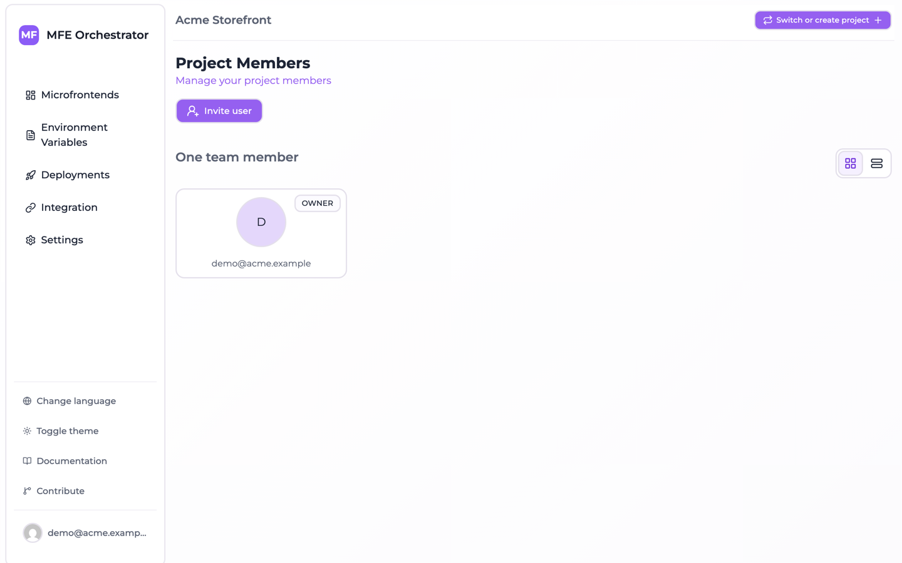
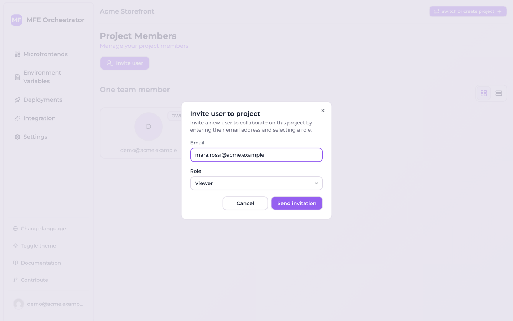

# Project members and roles

A user can be a member of several projects, and a role is recorded for them in each one. That role
is a **label**: it is stored, shown as a badge and named in the invitation email, but nothing in the
platform reads it to decide whether an action is allowed. Inside a project, **membership itself is
the boundary** — read the warning under [Roles](#roles) before you invite anybody.

Which projects a person can reach at all is decided one level up, by the organization that owns
them:

> The [organization role](../organizations/roles-and-visibility.md) answers *which projects*.
> Project membership answers *whether this is one of them* — and everybody who is in can do
> everything in it.

Two consequences are worth keeping in mind while reading the rest of this page:

- **Whoever administers the organization reaches every project in it**, invited or not. Somebody who
  must be read-only cannot be an organization owner or admin — and, per the warning below, cannot be
  a member of the project either.
- **Inviting somebody to a project also puts them into the owning organization**, as a plain member.
  See [Inviting a member](#inviting-a-member) below.

Members live under **Settings → Team Members**.

## Roles

:::danger Any role on a project grants full control of that project
Every write inside a project goes through a single authorization check, and that check asks whether
you are a **member** of the project — never which role you hold. A **Viewer can invite members,
rename the project and delete it**, exactly as an Admin can. The console gates nothing either: the
invite button and the Danger Zone render for every member.

So invite somebody to a project only if you would let them delete it. Somebody who must not be able
to change a project cannot be given a role in it — put their work in a separate project instead.
:::

The role exists as a label, and there are three of them:

| Role in the console | Stored and returned by the API as | Notes |
| --- | --- | --- |
| **Admin** | `OWNER` | The last Admin of a project cannot be removed |
| **Editor** | `MEMBER` | |
| **Viewer** | `VIEWER` | The value the invite dialog starts on |

The console is not consistent about which of the two names it shows. The **invite dialog** offers
*Admin*, *Editor* and *Viewer*; the badge on the members list prints the stored value — `OWNER`,
`MEMBER` or `VIEWER` — and so does the API. Invitation emails name the role as well.

### The one thing the role decides

The last Admin is protected from removal: the API refuses to remove the final `OWNER` of a project,
and the console disables the button. That is the only outcome a project role changes. Renaming,
deleting, inviting, deploying, editing microfrontends, environments or variables: none of them
consult it.

Choose the role, then, as documentation of intent rather than as a control — it tells the next person
who opens the members list what you meant this member to be. Keep at least two Admins, so the
protection above cannot strand a project whose only Admin has left.

### Restricting who can deploy to production

There is no way to do this inside one project. There is no per-environment permission split, and per
the warning above no per-role enforcement either, so an Editor and a Viewer can both deploy `prod`
as soon as they are members. The only mechanism that works today is a **separate project** for
production, whose membership is the smaller group. The ability to ship and the ability to
[roll back](../deployments/rollback-and-redeploy.md) travel together in any case: both are a
deployment.

## Inviting a member

1. Go to **Settings → Team Members** and click **Invite user**.

   

2. Enter their **email address**.
3. Choose a **role**.
4. **Send invitation**.

   

An email goes out with an invitation link. The invitee follows it, signs in or registers, and joins
the project with the role you chose.

:::info The invitation reaches the organization too
A project sits inside an organization, so inviting somebody to a project also adds them to that
organization — as a plain **member**, created already accepted. That membership grants nothing on
its own: a plain member reaches only the projects they were invited to, which is exactly the project
you just invited them to. Somebody who already holds a role in the organization keeps it; a project
invitation never demotes an admin. Declining the invitation takes the implicit membership back
again, unless they have other projects there. See
[Roles and project visibility](../organizations/roles-and-visibility.md#inviting-to-a-project-creates-a-membership-in-the-organization).
:::

:::caution Without SMTP an invitation becomes an unverified membership
Invitations are delivered by email, so the installation needs SMTP configured. On a self-hosted
instance without `EMAIL_SMTP_HOST` set the invitation does not fail — it degrades. No email is sent,
no link is generated, and the address you typed is added to the project as an **already active
member**, with nothing having proved that the person owns that address. Resending an invitation is
the only action that errors in that state.

Combined with the warning above, that means a typo hands full control of the project to whoever owns
the address you mistyped. Configure SMTP before you invite anybody — see
[Environment Variables](../self-hosting/environment-variables.md).
:::

## Managing invitations

Accepted members and pending invitations are two separate sections of the page, not one list with a
status column:

| Section | Columns |
| --- | --- |
| Members — as cards, or as a table from the view switcher | User, Role, Actions |
| **N pending invitations** — the heading counts them, and appears only when there are any | Email, Role, Expires on, Actions |

An invitation expires five days after it is sent, which is the date under **Expires on**.

For a pending invitation you can:

- **Resend** — send the email again, for the classic case of it landing in spam. The only action with
  a visible label, and even that is hidden on a narrow window.
- **Revoke** — cancel it, so the link no longer works. An icon-only button: the **✕** at the end of
  the row, which names itself on hover.

## Changing a role

Not from the console: the role is a read-only badge, and nothing in the interface writes it. The
management API does expose `PUT /projects/:projectId/users/:userId`, but no page calls it.

The one way through the interface is to **invite the same address again while its invitation is still
pending**: that refreshes the pending row with the role you pick the second time, and sends a new
link. Once an invitation has been accepted, re-inviting the address is refused as already a member.

Given that the role decides nothing, this is a cosmetic limitation rather than an operational one —
but it does mean a badge can keep saying *VIEWER* about somebody you meant to promote.

## Removing a member

Remove them from the row's actions — the trash icon in the table, the **Remove** button on the card.
The confirmation is a plain dialog naming the person ("Are you sure you want to remove … from this
project?"), not the type-the-name gesture that [deleting a project](./projects.md#deleting-a-project)
asks for. The button is disabled for the last Admin, and when the project would be left with no
members at all.

They lose access to this project immediately; their account and their membership of other projects
are unaffected.

:::caution Removing them from the project does not remove them from the organization
Somebody who accepted the invitation stays in the organization as a plain member with no project —
harmless, since that grants nothing, but they remain on the organization's members list. Take them
out from [the organization page](../organizations/managing-an-organization.md#members) if you want
them gone entirely; doing so also removes them from every other project of that organization. An
invitation that was never accepted is cleaned up on its own when you revoke it.
:::

:::tip Removing a person is not enough
People leaving is also the moment to audit [API keys](../ci-cd/api-keys.md). A key that person
created keeps working after they are removed — keys belong to the project, not to the user who
created one. **Delete** any key they were the only consumer of: deletion is the only thing that
stops a key authenticating, as [Machine access](#machine-access) explains.
:::

## Authentication

How members sign in depends on the installation:

| Method | Notes |
| --- | --- |
| Email and password | Available when embedded login is enabled |
| Google | Available when configured |
| Microsoft Entra ID (Azure) | Available when configured |
| Auth0 | Available when configured |

The hosted console offers email/password and Google. For self-hosted installations, the enabled
providers are whichever you configure — see
[Enable SSO](../self-hosting/enable-sso/Google.md).

Whichever method a user signs in with, their memberships are the same: authentication decides who
they are, project membership decides which projects they reach.

## Machine access

For CI pipelines and scripts, use [API keys](../ci-cd/api-keys.md) rather than a user account. A key
belongs to the project, so it survives any change to your own account.

The create dialog asks for two things, a **name** and an **expiration date**; the role is not among
them, and every key the console creates is stored as `MANAGER`.

:::caution Only deleting a key stops it
Authenticating a request looks the key up and checks nothing else — neither the stored status nor the
expiry date is read. A key past its expiration date still works, and the *Expired* badge in the list
is computed in your browser from that date alone. **Delete** is the only action that actually
revokes a key. See [API keys](../ci-cd/api-keys.md).
:::

Creating a "service user" with a shared password is the anti-pattern here: it cannot be rotated
without coordinating with everyone using it, and it muddies the audit trail.
