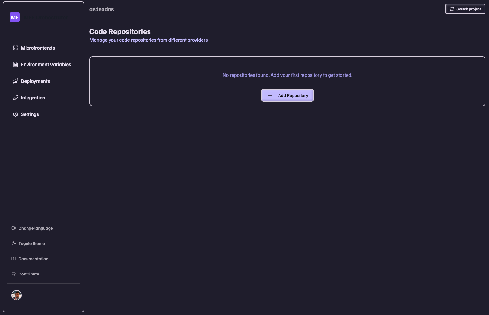
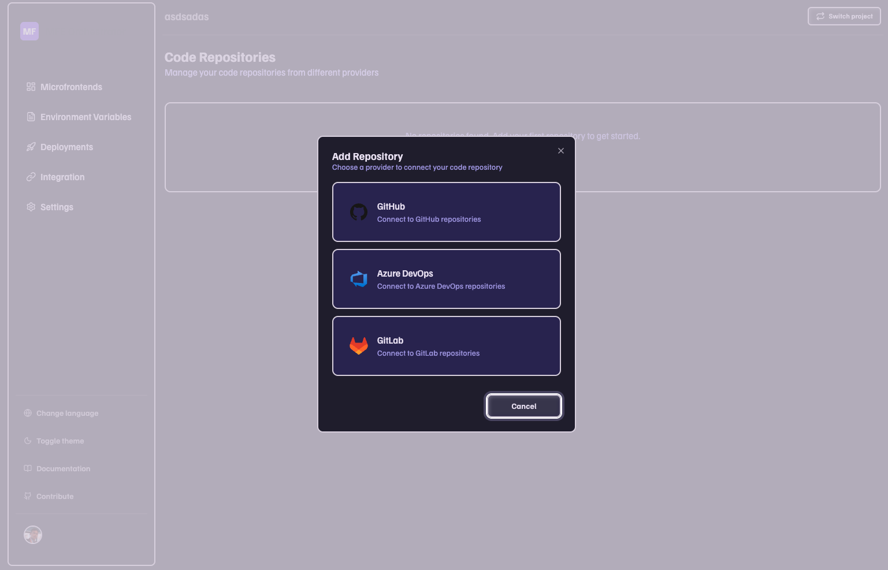

# Azure DevOps

This guide will walk you through connecting your Azure DevOps repositories to MFE Orchestrator.

## Prerequisites

- An active [Azure DevOps](https://dev.azure.com) account
- Access to at least one organization and project
- Admin permissions to create Personal Access Tokens

## Step 1: Navigate to Code Repositories

1. Go to **[Code Repositories](https://console.mfe-orchestrator.dev/code-repositories)** in MFE Orchestrator

2. Click the **Add Repository** button

3. Select **Azure DevOps** as your provider

## Step 2: Create a Personal Access Token (PAT)

A Personal Access Token is required to authenticate MFE Orchestrator with your Azure DevOps account.

### 2.1 Access Token Settings

1. Go to your Azure DevOps organization at `https://dev.azure.com/{your-organization}`
2. Click on your **User Settings** icon (top right corner)
3. Select **Personal Access Tokens**
4. Click **+ New Token**

### 2.2 Configure Token Settings

Fill in the token configuration:

- **Name**: Enter a descriptive name (e.g., "MFE Orchestrator")
- **Organization**: Select the organization(s) you want to connect
  - You can select **All accessible organizations** if you have multiple organizations
- **Expiration**: Set an expiration date
  - Recommended: 90 days or custom date
  - For security, avoid selecting "Full access" indefinitely

### 2.3 Required Token Scopes

:::warning Critical: Select the Correct Scopes
Make sure to select these **exact scopes** for MFE Orchestrator to function properly:
:::

In the **Scopes** section of the token creation dialog, configure the following permissions:

**1. Configure Code Scope**
   1. Find the **Code** section in the scopes list
   2. Click on the dropdown next to **Code**
   3. Select **Read, write & manage**

   > *This grants access to read source code, commits, and branches - required for fetching repository content and managing deployments*

**2. Configure Build Scope**
   1. Scroll down to find the **Build** section
   2. Click on the dropdown next to **Build**
   3. Select **Read, write & manage**

   > *This grants access to build pipelines and build results - required for triggering builds and monitoring build status*

**3. Configure Release Scope**
   1. Continue scrolling to find the **Release** section
   2. Click on the dropdown next to **Release**
   3. Select **Read, write & manage**

   > *This grants access to release pipelines and deployment information - required for managing releases and deployment workflows*

:::tip Quick Check
After selecting all scopes, verify that you have:
- ✅ Code: Read, write & manage
- ✅ Build: Read, write & manage
- ✅ Release: Read, write & manage
:::

### 2.4 Generate the Token

1. After selecting all required scopes, click **Create**
2. **Important**: A dialog will appear with your token
3. **Copy the token immediately** and save it securely, you won't be able to see this token again!

## Step 3: Configure Connection in MFE Orchestrator

Now that you have your PAT, return to MFE Orchestrator to complete the connection.

### 3.1 Fill in Connection Details

In the **Add Repository** dialog, enter the following information:

1. **Name**: Enter a descriptive name for this connection
   - Example: `"My Azure DevOps"` or `"Company Name DevOps"`
   - This helps you identify the connection if you have multiple repository sources

2. **Organization Name**: Enter your Azure DevOps organization name
   - This is the part after `https://dev.azure.com/` in your URL
   - Example: If your URL is `https://dev.azure.com/my-company`, enter `my-company`

3. **Personal Access Token**: Paste the PAT you created in Step 2
   - Copy and paste the full token
   - Make sure there are no extra spaces

### 3.2 Test and Save the Connection

Before saving, verify that everything is configured correctly clicking on **Test Connection** button

:::tip Connection Test Success
If the test is successful, you'll see a **green checkmark** and a success message. If it fails, double-check your organization name and PAT.
:::

1. Once the test is successful, click **Connect Azure Dev Ops**
2. Your Azure DevOps connection is now active!

## Troubleshooting

### Connection Test Fails

If the connection test fails, check the following:

- **Invalid Organization Name**: Verify that the organization name matches exactly what appears in your Azure DevOps URL
- **Insufficient Permissions**: Ensure you selected all three required scopes (Code, Build, Release) with "read, write & manage" permissions
- **Expired Token**: Check if your PAT has expired and create a new one if needed
- **Network Issues**: Verify that you have internet connectivity and can access Azure DevOps

### Token Permissions Error

If you see a permissions error after connecting:

1. Go back to Azure DevOps - Personal Access Tokens
2. Find your MFE Orchestrator token
3. Click **Edit** or **Revoke** and create a new token
4. Ensure all required scopes are selected
5. Update the token in MFE Orchestrator settings

### Cannot See My Project

If your project doesn't appear in the dropdown:

- Verify that you have access to the project in Azure DevOps
- Make sure the PAT has access to "All accessible organizations" or the specific organization
- Check that the project is not archived or deleted

## Security Best Practices

:::warning Token Security
Follow these best practices to keep your account secure:
:::

- **Never share** your Personal Access Token with anyone
- **Use specific scopes** - only grant the permissions that are needed
- **Set expiration dates** - tokens should expire after 90 days or less
- **Rotate tokens regularly** - create new tokens periodically
- **Revoke immediately** if compromised - if you suspect a token has been exposed, revoke it right away and create a new one
- **Use separate tokens** for different services - don't reuse the same PAT across multiple integrations

## Need Help?

If you encounter any issues or need assistance:

- Check the [Azure DevOps documentation](https://docs.microsoft.com/en-us/azure/devops/)
- Review the [PAT documentation](https://docs.microsoft.com/en-us/azure/devops/organizations/accounts/use-personal-access-tokens-to-authenticate)
- Contact MFE Orchestrator support