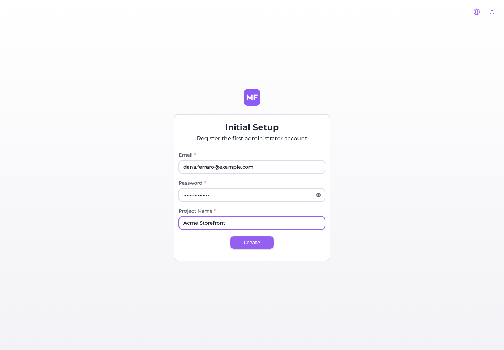
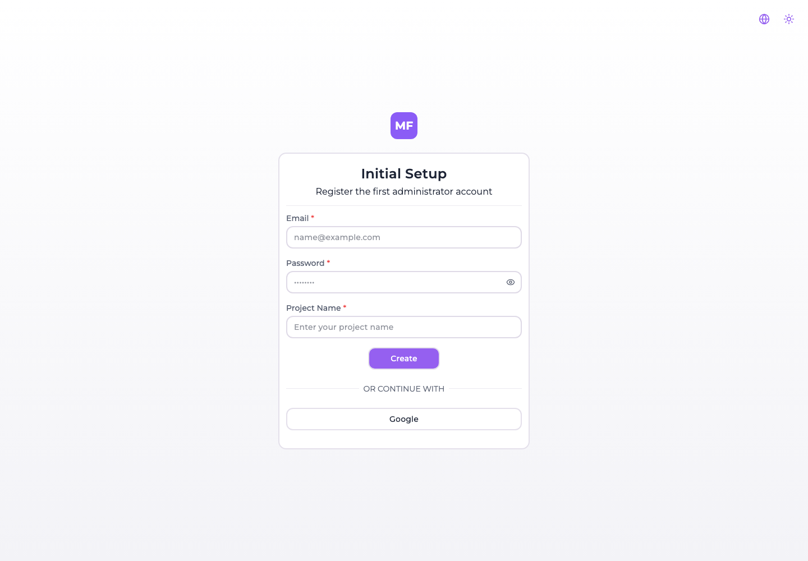

# The first startup

An installation whose database holds **no users at all** does not show a login form. It shows this
instead, and it is the first thing you will see after any of
[Docker](./docker.md), [Docker Compose](./docker-compose.md), [Helm](./helm.md) or
[Terraform](./terraform.md):

One form, three fields, and it creates everything an installation needs to be usable: the first
account, the organization it owns, and one project inside it.

:::danger Fill it in before anybody else can
The endpoint behind this form is public, and it has to be — there is no account yet to authenticate
with. It is also **not gated on anything**: not on `REGISTRATION_ALLOWED`, and not on the
installation still being empty.

So between the moment your container answers its first request and the moment you submit this form,
**whoever reaches the console first becomes its owner** — with an organization and a project of their
own. On a box that is already reachable from the internet, that window is a real one.

Do the first startup before you publish the address, or keep the port closed until you have. See
[The endpoint stays open](#the-endpoint-stays-open) for the part that does not close afterwards.
:::

## When it appears, and what it replaces

The console asks `GET /api/startup/users/exists` before it renders anything, and this screen is what
it renders when the answer is *no*. That check sits **outside every route**, so on an empty
installation the setup screen is not merely the home page — it is the only page. `/register`, a
password reset link, an invitation link: all of them show Initial Setup instead of what they point
at.

That is worth knowing when you are testing an installation from scratch, because it looks like the
routes are broken when in fact the database is simply empty.

Once one user exists the screen is gone for good, and the console shows the login form from then on.

## The three fields

| Field | Rule |
| --- | --- |
| **Email** | Must look like an address. It becomes the account you sign in with, and it cannot be changed later — see [Your profile](../account/profile.md#personal-data). |
| **Password** | At least 8 characters. |
| **Project Name** | At least 3 characters. It names *three* things, not one — see below. |

## What Create actually creates

In this order, and all of it from that one project name:

| # | What | Named |
| --- | --- | --- |
| 1 | The **user** | The email and password you typed. Created as active, and it owns everything below. |
| 2 | The **organization** | **The project name.** There is no field for it on the form, so your project name becomes your tenant's name too. |
| 3 | The **project** | The project name, with the same string as its description. |

The organization is created first because a project cannot exist outside one, and the user is made
its **owner** — no other row would grant the right to administer it.

:::caution The project name becomes a permanent slug, and it mishandles spaces
The project's slug is derived from the name you type here, and the derivation replaces only the
**first** space. A name of two words is fine; a longer one is not:

| Project Name you type | Slug you get |
| --- | --- |
| `Storefront` | `storefront` |
| `Acme Storefront` | `acme-storefront` |
| `My Cool Storefront App` | `my-cool storefront app` ← literal spaces |

That slug is **not editable afterwards** — not from the console, where it is a read-only value, and
not through the API, which refuses to write it on purpose: the slug is part of the storage path
uploaded bundles live under (`<slug>-<id>/…`), so moving it would orphan every deployed file.

Renaming the project later changes its name and leaves the slug as it is. So on this one screen,
prefer a **one or two word project name**. The organization's slug is generated properly from the
same string, which is why the two can end up disagreeing.
:::

## You are not signed in afterwards

Submitting the form creates the three records and hands you to the **login form** — it does not open
a session. Sign in with the email and password you just chose.

If SMTP is configured, an activation email goes out to that address as well. You do not need to wait
for it or act on it: as [Activation, password reset and invitations](../account/email-flows.md#registration-and-activation)
explains, nothing refuses a session to an account whose activation link was never followed.

## Creating the first user with SSO instead

When at least one [authentication provider](./enable-sso/Google.md) is configured, the setup screen
offers it below the form:

That route works, and it is the only way to bootstrap an installation that has embedded login turned
off. It also does **less**: signing in with a provider creates the user and nothing else — no
organization, no project, because the form's project name was never submitted.

So the two paths land you in different places:

| You used | You get | And then |
| --- | --- | --- |
| The form | User, organization, project | Sign in and start working |
| A provider | User only | The console asks you to [create an organization](../organizations/managing-an-organization.md#creating-an-organization), then a project |

Neither is wrong; the SSO path simply has two more steps in front of it.

## The endpoint stays open

`POST /api/startup/registration` does not stop working once the installation has users. It is public,
it checks neither `REGISTRATION_ALLOWED` nor whether a user already exists, and calling it on a fully
populated installation creates another user with another organization and another project.

:::danger `REGISTRATION_ALLOWED=false` does not close either registration route
The variable is read in exactly one place in the backend: to compute the `canRegister` flag the
frontend uses to decide whether to show the *Register* link. No route enforces it.

With `REGISTRATION_ALLOWED=false` set, both `POST /api/users/registration` and
`POST /api/startup/registration` still accept a request and create a usable account that signs in
normally. Treat the variable as **hiding a link, not as closing a door**, and put the access control
in front of the console — a private network, an ingress rule, an authenticating proxy — if the
installation must not accept new accounts.
:::

## After the first startup

You have an account, an organization and an empty project. From here:

1. [Create your first microfrontend](../microfrontends/create-a-microfrontend.md).
2. Connect a [bucket](../buckets/overview.md) if you want the platform to host the bundles.
3. Configure [SMTP](./environment-variables.md) before inviting anybody — without it invitations,
   password resets and account activation [cannot work](../account/email-flows.md).
4. Set [`SECRETS_ENCRYPTION_KEY`](./encryption-at-rest.md) before you store any credential.
